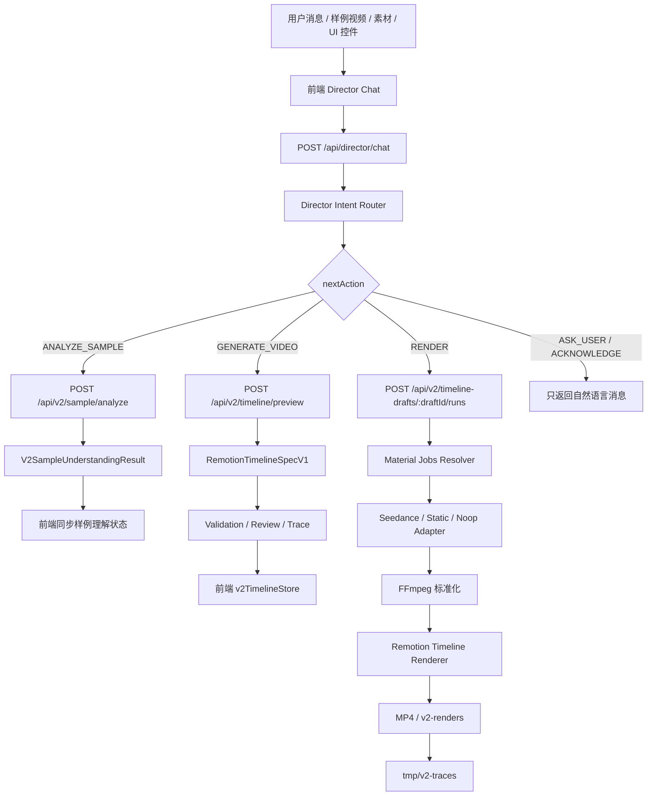
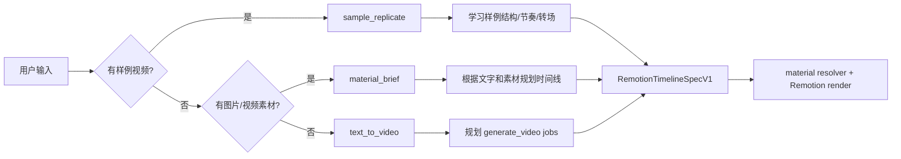
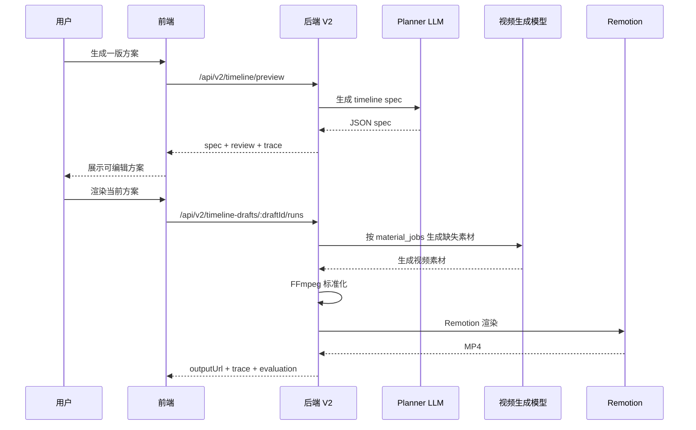

# 项目现状总览

本文档用于记录当前仓库的真实代码状态、应用场景、系统边界、V2 链路、智能体设计、前后端通信、协议格式、可观测性、已知不足和后续优化方向。它不是产品宣传稿，而是后续重构、排查和讨论时的工程参考。

## 0. 三分钟快速接手版

如果第三方 agent 或开发者只先读一页，应先记住以下结论：

- 当前项目主线是 V2，不是 V1 RenderPlan workflow。
- 新的视频生成、规划、素材生成、渲染能力优先接入 `backend/src/pipeline-v2/`。
- V2 的核心协议是 `shared/types/remotion-timeline-spec.v1.ts` 中的 `RemotionTimelineSpecV1`。
- V2 导演正式执行入口是后端 `modules/director-agent/director-agent.service.ts`，Tool/Skill 权威目录与调度位于 `backend/src/pipeline-v2/agent-tools/`、`agent-skills/`；前端只发送输入、展示事件并同步服务端草稿快照。
- V2 的后端 API 是 `/api/v2/sample/analyze`、`/api/v2/timeline/preview`、`/api/v2/timeline-drafts/:draftId/runs`。
- V2 的 trace 在 `backend/tmp/v2-traces/`：导演会话走 `sessions/<workspace>/operations/<operation>/`，独立调用走 `tasks/<taskId>/`；不要把旧的 `backend/tmp/agent-trace` 当成主线证据。
- V2 支持三条分支：有样例视频的 `sample_replicate`、无样例但有素材的 `material_brief`、纯文字的 `text_to_video`。
- 不要把“生成视频”重新绑定成“必须先上传样例视频”。
- 不要把“纯文字生成”误判成缺素材；如果外部视频模型不支持纯文生视频，应在能力层说明，而不是要求用户补样例。
- Remotion 当前负责确定性编排、字幕、转场、覆盖层和渲染，不负责生成复杂真实画面。
- Seedance 等视觉生成模型负责真实画面素材，FFmpeg 负责标准化，Remotion 负责最终时间线渲染。
- V1 代码仍可能被 UI 兼容层引用，不能直接批量删除；应先隔离判断，再逐步替换。
- 后续所有改动至少要保证：后端 build 通过、前端 build 通过、V2 三分支不被破坏、trace 仍写入 V2 目录。

接手时优先阅读顺序：

1. 本文档第 4 节 V2 主链路。
2. 第 6 节核心协议。
3. 第 11 节 trace。
4. 第 17 节 V1/V2 边界与重构守则。
5. 第 18 节第三方接手执行手册。

## 1. 项目定位

当前项目可以理解为一个面向短视频创作的 AI 导演工作台。用户通过自然语言、样例视频、图片/视频素材和画幅等控制项，和一个导演助理式智能体对话；系统将用户意图转成可审查、可编辑、可渲染的视频时间线，再通过 Remotion、FFmpeg 和外部视觉生成模型生成最终 MP4。

项目的核心方向已经从早期“样例视频风格迁移 workflow”逐步转向“智能体驱动的视频生成编排系统”。这里的智能体不是直接自由生成最终视频，而是负责理解用户意图、判断当前上下文、规划任务分支、生成结构化时间线、调用工具和兜底机制。

适合的应用场景包括：

- 基于样例视频学习结构、节奏、镜头和转场，再使用用户素材生成同类风格短片。
- 仅基于用户提供的文字和图片/视频素材，生成一版可编辑的视频方案。
- 仅基于文字描述，调用视频生成模型补充真实画面，再用 Remotion 负责字幕、转场、时间线和覆盖层。
- 社交媒体短视频、旅行/风景混剪、产品展示、活动宣传片、图文转视频、字幕叙事短片。

不适合或暂不稳定的应用场景包括：

- 电影级复杂视觉特效。
- 精细人物表演和高一致性角色剧情。
- 需要专业调色、复杂音效设计、复杂 3D 动画的成片。
- 完全依赖 Remotion 生成真实世界复杂画面的任务。

## 2. 当前总体架构

仓库主要分为六块：

- `fonted/`：前端 React + Vite 应用，负责聊天、素材上传、方案展示、时间线、预览和导出入口。
- `backend/`：Express 后端，负责 API、上传、智能体意图路由、样例理解、V2 时间线规划、素材生成、标准化、Remotion 渲染和 trace。
- `shared/`：前后端共享协议、类型、校验器、对话状态机、RenderPlan/V2 Timeline 相关工具。
- `remotion/`：Remotion 渲染工程，当前 V2 通过固定渲染器读取 `RemotionTimelineSpecV1` 生成视频。
- `desktop/`：Electron 桌面壳，负责一个命令启动本地前端和后端。
- `official-skills/`：Remotion 官方 skills，本项目可用于后续指导模型正确理解 Remotion 写法和边界。

根目录 `package.json` 的主要命令：

- `npm run desktop:dev`：启动 Electron 桌面端，并由桌面壳托管前端和后端服务。
- `npm run v2:check`：执行 V2 相关构建和 smoke 检查。
- `npm run v2:smoke`：运行 V2 timeline service 的 smoke 测试。

桌面端启动逻辑：

1. `desktop/scripts/dev.mjs` 启动 Electron。
2. `desktop/main.cjs` 查找可用端口。
3. 启动 `backend npm run dev`。
4. 启动 `fonted npm run dev`。
5. Electron 加载本地前端页面。

当前桌面模式下仍是本地多进程托管，不是单二进制打包形态。用户侧体验是一个命令启动，但工程上仍存在前端 dev server、后端 server、Remotion 渲染进程和外部模型调用。

## 3. 后端结构

后端入口是 `backend/src/app.ts`。

核心 HTTP 路由包括：

- `GET /health`：后端健康检查。
- `POST /api/uploads`：上传素材，支持本地访问 URL、公共 URL 发布和重复文件 hash 识别。
- `POST /api/director/chat`：导演智能体对话入口。
- `GET/POST /api/creative-memories`、`GET /api/creative-memories/search`、`PATCH/DELETE /api/creative-memories/:memoryId`：创作偏好记忆的查询、新增、检索、修改与删除。
- `POST /api/v2/sample/analyze`：V2 样例视频理解。
- `POST /api/v2/timeline/preview`：V2 时间线方案预览，只规划和校验，不渲染。
- `POST /api/v2/timeline-drafts/:draftId/runs`：对已保存的 V2 草稿版本执行素材生成、标准化、Remotion 渲染和基础评估，并持久化 RenderRun。
- `/uploads`：本地上传素材静态访问。
- `/renders`：旧渲染结果静态访问。
- `/v2-renders`：V2 渲染结果静态访问。

后端主要模块：

- `modules/director-agent/`：导演对话智能体，包括 LLM 意图路由、硬保护和控制器。
- `modules/creative-memory/`：创作偏好记忆的持久化、关键词检索、批量动作应用与管理接口（user/draft 作用域、active/candidate/revoked 状态、来源会话与轮次溯源）。
- `modules/upload/`：上传、本地保存、去重、公共素材发布。
- `pipeline-v2/`：当前重点 V2 链路。

## 4. V2 主链路

V2 是目前应当优先维护的主链路，核心目录是 `backend/src/pipeline-v2/`。

主要文件职责：

- `v2-input.ts`：V2 Planner 输入类型。
- `agent-skills/registry.ts`：官方 V2 Skill 目录、阶段化加载、依赖与 Tool 许可关系。
- `agent-tools/registry.ts`：模型可选 Tool 的 schema、可用性、权限和恢复元数据。
- `agent-tools/dispatcher.ts`：后端唯一的 V2 Tool 调度入口。
- `controller.ts`：V2 API 控制器。
- `sample-understanding-service.ts`：样例视频理解。
- `remotion-timeline-llm-planner.ts`：LLM Planner prompt、调用、JSON 提取和校验。
- `remotion-timeline-planner.ts`：确定性 Planner 兜底。
- `hard-requirements.ts`：从用户 prompt 抽取硬要求，如字幕必须出现。
- `remotion-timeline-review.ts`：生成方案审查指标和中文审查说明。
- `material-generation-adapter.ts`：素材生成适配器接口。
- `ark-seedance-adapter.ts`：Ark Seedance 视频生成模型适配器。
- `configured-material-adapter.ts`：根据环境变量选择真实、静态或空适配器。
- `remotion-timeline-material-resolver.ts`：执行 `material_jobs`，生成或复用素材。
- `media-standardizer.ts`：FFmpeg 标准化生成视频素材。
- `remotion-timeline-renderer.ts`：把 V2 spec 交给 Remotion 渲染。
- `remotion-timeline-service.ts`：V2 preview/run 的总编排服务。
- `trace.ts`：V2 trace 写入器。
- `ffmpeg-binary.ts`、`ffmpeg-preflight.ts`：FFmpeg 检测和预检。

V2 支持三种创作分支：

1. `sample_replicate`
   - 输入：样例视频，可选用户素材。
   - 目标：学习样例视频结构、节奏、镜头、转场、氛围。
   - 注意：样例视频只作为结构和风格参考，不应直接作为成片素材。

2. `material_brief`
   - 输入：用户文字 + 图片/视频素材，无样例视频。
   - 目标：根据素材内容和用户意图直接规划一条可编辑时间线。
   - 适合：图片转视频、素材混剪、风景图/产品图/活动素材生成短片。

3. `text_to_video`
   - 输入：纯文字，无样例视频、无视觉素材。
   - 目标：Planner 规划 `generate_video` 任务，由外部视频生成模型补充真实画面。
   - 兜底：如果模型生成失败，可以保留 Remotion 卡片/字幕类 fallback，避免任务直接断掉。

V2 preview 链路：

1. 接收 `V2PlannerInput`。
2. 写入 `01-input/timeline-planner-input.json`。
3. 从 prompt 抽取硬要求。
4. 调用 LLM Planner。
5. 如果 LLM Planner 失败，按配置回退到确定性 Planner。
6. 应用硬要求。
7. 校验 `RemotionTimelineSpecV1`。
8. 生成 planning review。
9. 写入 trace。
10. 返回 spec、validation、review、traceDir。

V2 run 链路：

1. 接收用户输入或当前 timeline override。
2. 生成或复用 V2 timeline spec。
3. 校验 spec 和硬要求。
4. 执行 `material_jobs`。
5. 对生成视频做 FFmpeg 标准化。
6. 再次校验可渲染 spec。
7. 调用 Remotion 渲染 MP4。
8. 写入渲染命令、日志、结果和基础 evaluation。
9. 返回最终 outputPath、traceDir、evaluation。

## 5. 前端结构和交互

前端核心目录是 `fonted/src/`。

关键模块：

- `components/sidebar/DirectorChatPanel.tsx`：导演聊天面板。
- `components/sidebar/ChatInput.tsx`：输入框、附件、画幅等控制项。
- `components/canvas/MigrationCanvas.tsx`、`GeneratedPlayer.tsx`：V2 方案画布与播放器（沿用迁移期命名）。
- `services/director/v2DirectorDraftWorkspace.ts`：V2 草稿激活桥接，把持久化 spec 打开到时间线工作区。
- `services/director/v2DirectorTimeline.ts`：前端组装 V2 API payload、上传 blob、同步工作台状态。
- `lib/api.ts`：前端 HTTP API 封装。
- `stores/directorChatStore.ts`：对话消息状态。
- `stores/directorContextStore.ts`：导演上下文，包括样例、素材、用户意图等。
- `stores/v2TimelineStore.ts`：V2 timeline spec、preview、result 和 trace 状态。
- `stores/taskStore.ts`：任务进度和后台状态。
- `stores/timelineStore.ts`、`pipelineStore.ts`、`migrationProjectStore.ts`：兼容旧工作台的数据同步层。

前端执行过程大致为：

1. 用户发送自然语言和附件。
2. 前端整理当前上下文、附件、画幅、时长和已有 V2 timeline。
3. 调用 `/api/director/chat`；理解模型在结构化决策中选择本轮 Skill 与 Tool。
4. 后端 Registry 校验 Skill/Tool 关系、参数、V2 状态与交付授权，并按阶段调度 Tool。
5. Tool 真实结果先写回 V2 草稿/会话，再由理解模型基于结果生成自然回复。
6. 前端消费 `skill_selected`、`skill_loaded`、`tool_*`、`assistant_reply` 和 `workspace_snapshot` 事件，更新右侧预览区、时间线和 trace 地址。

`/api/v2/sample/analyze`、`/api/v2/timeline/preview` 和草稿 RenderRun API 仍可直接调用；导演正式链路不再由前端 action 映射决定执行顺序。

当前前端同时存在 V1 数据结构适配层和 V2 timeline store，这能保证旧 UI 仍可显示，但也增加了状态同步复杂度。

## 6. 核心协议

### 6.1 V2PlannerInput

位置：`backend/src/pipeline-v2/v2-input.ts`

核心字段：

- `taskId`：任务 ID。
- `prompt`：用户原始需求。
- `creationMode`：`sample_replicate`、`material_brief`、`text_to_video`。
- `mainVideoPath`：成片可用主视频素材路径。
- `inputImageUrl`：视频生成模型可访问的公网图片 URL。
- `referenceVideoPath`：样例视频路径，只作为风格/结构参考。
- `sampleUnderstanding`：样例理解结果。
- `conversationSummary`：对话压缩摘要。
- `materials`：用户素材数组。
- `durationSec`：目标时长。
- `plannerMode`：`llm` 或 `deterministic`。
- `allowPlannerFallback`：LLM 失败是否允许确定性兜底。
- `canvas`：画布宽高和 fps。

### 6.2 RemotionTimelineSpecV1

位置：`shared/types/remotion-timeline-spec.v1.ts`

这是 V2 的核心中间协议，也是 Remotion 渲染器读取的结构化 JSON。

主要字段：

- `schema_version`：固定为 `remotion_timeline_spec.v1`。
- `task_id`：任务 ID。
- `canvas`：宽、高、fps、总时长、背景。
- `assets`：视频、图片、音频素材。
- `scenes`：时间线主镜头。
- `transitions`：镜头之间的转场。
- `overlays`：字幕、标题、标签、图片角标、光效等覆盖层。
- `material_jobs`：素材复用、视频生成、请求用户素材等任务。
- `audio`：音频轨道。
- `render_policy`：当前渲染器固定为 `remotion_timeline`。
- `notes`：Planner 说明。

当前 scene 类型：

- `user_video`：用户视频素材。
- `ai_video`：外部模型生成的视频素材。
- `image_motion`：图片加 Remotion 运镜。
- `remotion_card`：Remotion 程序化卡片/文字场景。
- `caption_scene`：字幕场景。
- `data_viz`：数据可视化。

当前转场类型：

- `cut`
- `fade`
- `slide`
- `wipe`
- `light_flash`

当前覆盖层类型：

- `caption`
- `title`
- `label`
- `shape`
- `image_badge`
- `light_sweep`

### 6.3 Director 对话协议

相关文件：

- `shared/types/director-context.ts`
- `shared/lib/director-understanding.ts`
- `backend/src/modules/director-agent/llm-intent-router.ts`
- `shared/lib/director-action-engine.ts`

智能体意图类型包括：

- `analyze_sample`
- `analyze_materials`
- `revise_plan`
- `generate_video`
- `render`
- `clarify`
- `unknown`

下一步动作包括：

- `ASK_USER`
- `ANALYZE_SAMPLE`
- `GENERATE_VIDEO`
- `RENDER`
- `REVISE_PLAN`
- `ACKNOWLEDGE`
- `NEED_BACKEND`
- `NEED_SAMPLE`
- `WAIT`

当前设计上，对话智能体只决定“下一步做什么”和“如何自然回复用户”，不直接生成最终 Remotion spec。真正的视频时间线由 V2 Timeline Planner 生成。

## 7. 通信方式

前后端 HTTP 通信主要通过 `fonted/src/lib/api.ts` 封装。

主要请求：

- 上传素材：
  - `POST /api/uploads`
  - 使用 `multipart/form-data`
  - 可带 `requirePublicUrl=true`
  - 返回本地 URL、本地路径、公共 URL、hash、重复文件信息。

- 导演对话：
  - `POST /api/director/chat`
  - 传入用户 prompt 和当前上下文。
  - 返回 intent、nextAction、assistantMessage、publicThoughts 等。

- 样例理解：
  - `POST /api/v2/sample/analyze`
  - 传入样例视频路径、任务 ID 和 prompt。
  - 返回 `V2SampleUnderstandingResult` 和 traceDir。

- 时间线预览：
  - `POST /api/v2/timeline/preview`
  - 返回 `RemotionTimelineSpecV1`、validation、review、traceDir。

- 时间线渲染：
  - `POST /api/v2/timeline-drafts/:draftId/runs`
  - 返回最终 spec、素材生成报告、标准化资产、渲染结果、evaluation 和 traceDir。

V2 任务进度通过 Director SSE 的 `tool_progress` 事件推送；旧 `/ws/tasks` WebSocket 任务通道已移除（2026-08-04）。

## 8. 素材处理

上传目录：

- `backend/uploads`

上传逻辑：

1. Multer 将文件落盘到 `backend/uploads`。
2. `upload.service.ts` 计算 SHA-256。
3. 写入或读取 `.upload-index.json`。
4. 如果已有相同 hash 文件，则删除新文件，返回 canonical 文件。
5. 如果配置了 asset publisher，可生成公网可访问 URL。

本地 Remotion 渲染可以使用本地路径或被复制到 `remotion/public/v2-assets/<taskId>` 后通过 `static:` 访问。

外部视频生成模型不能访问 localhost、本地路径或 file URL。图生视频场景必须使用公网 HTTPS 图片 URL。纯文生视频不需要图片 URL，但取决于外部模型 API 是否真的支持纯文本输入。

## 9. 外部模型接入

当前主要外部模型类型：

- 理解模型：用于样例视频理解和导演意图路由。
- 规划模型：用于生成 V2 timeline spec。
- 视觉生成模型：当前通过 Ark Seedance adapter 接入，用于 `generate_video` material job。

相关环境变量职责：

- `ARK_API_KEY`：Ark 通用 API Key。
- `VIDEO_UNDERSTANDING_API_KEY`：视频理解 API Key，可回退到 `ARK_API_KEY`。
- `VIDEO_UNDERSTANDING_MODEL`：样例理解模型。
- `DIRECTOR_AGENT_API_KEY`：导演意图路由和规划相关模型 Key。
- `DIRECTOR_AGENT_MODEL`：导演意图模型。
- `V2_VIDEO_GENERATION_PROVIDER`：V2 视频生成提供方，当前支持 `ark-seedance` 等配置。
- `V2_VIDEO_GENERATION_API_KEY`：视频生成模型 Key。
- `V2_VIDEO_GENERATION_MODEL`：视频生成模型名。
- `V2_VIDEO_GENERATION_SUBMIT_URL`：视频生成提交 URL。
- `V2_VIDEO_GENERATION_STATUS_URL_TEMPLATE`：任务查询 URL 模板。
- `V2_VIDEO_GENERATION_DEFAULT_IMAGE_URL`：可选默认图生视频参考图。
- `PUBLIC_ASSET_BASE_URL` / `ASSET_PUBLISHER_*` / `TOS_*`：用于让本地上传素材变成外部模型可访问 URL。

注意：项目文档和 trace 不应记录 API Key 明文。

## 10. Remotion 使用方式

当前 V2 对 Remotion 的定位是“程序化时间线渲染器”，不是让 Remotion 自由创作真实世界画面。

Remotion 当前负责：

- 读取结构化 JSON。
- 按时间线摆放视频、图片、文字、覆盖层和转场。
- 对图片做基础运镜。
- 对字幕、标题、标签、光效等程序化元素做动画。
- 输出 MP4。

Remotion 当前不负责：

- 创作缺失的真实视觉内容。
- 生成复杂人物、真实场景或电影级镜头。
- 自由解释抽象视觉描述。

V2 使用“固定渲染器 + 严格 JSON”模式。缺少合适预设或已注册组件时，`render.author` 可按需生成组件，但必须经过源码审计、编译、试渲染、视觉验收和服务端注册，Director 与 Planner 不能直接写入 React 源码或伪造组件 ID。

`official-skills/` 中已经放入 Remotion 官方 skills。编码 Agent 只在 `render.author` 内使用受控知识和沙箱，不直接进入普通时间线规划链路。

## 11. Trace 和可观测性

V2 trace 默认写入（2026-08-04 起统一根目录与分层，旧目录与运行产物已清理）：

- `backend/tmp/v2-traces/sessions/<workspace>/operations/<operation>/`：导演会话（含事件流 `events.jsonl`）。
- `backend/tmp/v2-traces/tasks/<taskId>/`：样例理解、时间线 preview/run 等独立调用。

主要阶段：

- `00-summary/summary.zh.md`
- `01-input/timeline-planner-input.json`
- `01-input/timeline-hard-requirements.json`
- `02-planning/llm-timeline-planner-prompt.md`
- `02-planning/llm-timeline-planner-raw-response.json`
- `02-planning/llm-timeline-planner-extraction-report.json`
- `02-planning/llm-timeline-planner-error.json`
- `02-planning/timeline-fallback-spec.json`
- `02-planning/timeline-spec.json`
- `02-planning/timeline-validation.json`
- `02-planning/timeline-hard-requirement-check.json`
- `02-plan-review/timeline-review.json`
- `02-plan-review/timeline-review.zh.md`
- `03-material-jobs/timeline-material-resolution.json`
- `04-material-assets/timeline-standardized-assets.json`
- `05-remotion-props/timeline-render-validation.json`
- `05-remotion-props/timeline-render-spec.json`
- `06-remotion-render/timeline-render-result.json`
- `06-remotion-render/timeline-render-command.txt`
- `06-remotion-render/timeline-render.log`
- `07-evaluation/timeline-evaluation.json`

查看顺序建议：

1. 先看 `00-summary/summary.zh.md`，判断本次任务是 preview 还是 run。
2. 再看 `01-input/timeline-planner-input.json`，确认用户输入、素材、画幅、分支是否正确。
3. 看 `02-planning/llm-timeline-planner-prompt.md` 和最终 `timeline-spec.json`，确认模型输入输出是否对齐。
4. 看 `timeline-validation.json` 和 `timeline-hard-requirement-check.json`，确认结构和字幕硬要求是否通过。
5. run 阶段再看 `03-material-jobs`，确认是否真正调用 Seedance、是否 fallback。
6. 看 `05-remotion-props/timeline-render-spec.json`，这是最终交给 Remotion 的 spec。
7. 看 `06-remotion-render` 和 `07-evaluation`，确认渲染和基础质量。

当前 trace 已比早期 V1 分散文件更清晰，但仍有进一步压缩空间。

## 12. 智能体设计

当前系统中“智能体”主要体现在四层：

1. 对话意图路由层
   - 理解用户是聊天、提问、解析样例、生成方案、修改方案还是渲染。
   - 输出结构化 intent 和 nextAction。
   - 有 LLM 路由，也有规则兜底和硬保护。

2. Planner 层
   - 把用户意图、样例理解、素材、画幅、硬要求转换为 `RemotionTimelineSpecV1`。
   - LLM Planner 失败时回退到 deterministic planner。

3. Tool/Skill 层
   - 理解模型选择 Skill 和 Agent 级 Tool；后端 Registry 负责许可、阶段化加载、参数校验、调度、结果回写与 trace。
   - 当前可用 Skill 包括 V2 时间线创作、样例参考分析、字幕轨创作和 V2 渲染交付。
   - Remotion 字幕与渲染官方 Skill 作为只读依赖按需加载，不赋予模型写 JSX、安装依赖或执行任意代码的权限。
   - 素材任务解析、生成、FFmpeg 标准化、Remotion props 与渲染仍是 Tool 内部确定性步骤，不暴露成大量模型工具。

4. 审查与兜底层
   - Validator 检查 spec。
   - hard requirements 检查字幕等硬约束。
   - material resolver 对生成失败做 fallback。
   - render evaluation 做基础文件大小、镜头数、转场数等检查。

当前智能体仍不算完全成熟，原因是：

- 上下文管理仍偏薄。
- 用户反馈到方案修订的闭环不够精细。
- Planner 对素材内容的理解还不够深入。
- 前端对方案的展示仍不够用户友好。
- 真实视频质量强依赖外部模型和素材匹配。

## 13. 当前 workflow 与 agent 的关系

当前系统仍然保留明显 workflow 特征：

1. 用户输入。
2. 意图识别。
3. 模型按当前任务阶段选择 Skill 与 Tool。
4. 后端 Registry 校验并调度，执行结果回写 V2 工作区。
5. Planner 输出固定 JSON。
6. Validator 校验。
7. 素材生成/复用。
8. Remotion 渲染。
9. 理解模型依据真实结果回复，返回工作区快照和 trace。

它已经具备 agent 化特征：

- 能根据上下文选择 `sample_replicate`、`material_brief`、`text_to_video`。
- 能在对话层区分提问、生成、渲染、修改。
- 能调用不同工具完成任务。
- 能生成可审查中间结果。
- 能在 LLM 失败、素材生成失败时走兜底。

但它还不是完全自主智能体：

- 没有真正的长期记忆和用户偏好沉淀。
- 没有成熟的多轮任务规划和自我反思机制。
- 没有基于结果质量自动决定是否重试。
- 没有可靠的视觉结果理解和自动评价闭环。
- Tool/Skill 选择与当前可用执行器已闭环；音频、长期记忆和自定义 Remotion 组件仍处于 planned/disabled 状态，不向模型伪装为可用能力。

合理方向不是抛弃 workflow，而是把固定流程里的“决策点”交给智能体，把稳定的工程动作沉淀为工具。

## 14. 当前格式化输出

主要格式化输出分三类：

1. 用户可见文本
   - 聊天消息。
   - 方案卡片。
   - 时间线片段说明。
   - review 中文摘要。

2. 机器协议 JSON
   - Director intent JSON。
   - `V2PlannerInput`。
   - `RemotionTimelineSpecV1`。
   - validation report。
   - material resolution report。
   - render result。
   - evaluation。

3. Trace 文件
   - 阶段化 JSON。
   - LLM prompt markdown。
   - 中文 summary。
   - Remotion render command 和 log。

当前最大问题是：机器协议逐渐清晰，但用户可见方案仍偏工程化。普通用户看到 scene type、preset、asset id、trace 路径时，很难判断“这个镜头实际会是什么画面”。

## 15. 已知不足

### 15.1 对话体验不足

- 有些回复仍像流程提示，不像自然协作。
- 对用户问题的回答有时被 action 路由带偏。
- 有些状态栏、附件和进度 UI 没有及时清理，影响对话流畅度。
- debug 信息虽然有助测试，但和用户主对话混在一起时会造成干扰。

### 15.2 上下文管理不足

- 用户说“渲染吧”时，需要稳定识别当前右侧是否已有可渲染 V2 timeline。
- 用户对上一版方案的反馈需要映射到具体 scene、asset、transition、overlay，而不是重新生成一版完全不相关方案。
- 多轮对话摘要需要区分“可压缩信息”和“不可压缩硬约束”。

### 15.3 素材理解不足

- Director 和 Planner 已通过同一 Ark 图片输入适配读取图片像素；目前仍缺少可复用的持久化图片分析结果和真实业务集上的理解质量验证。
- 同类图片、重复图片、相似图片的聚类和使用策略仍不成熟。
- 图片内容虽然已进入模型上下文，但高质量镜头规划仍需通过真实素材场景验证。

### 15.4 方案展示不足

- 方案卡片仍偏程序化，普通用户难以理解每个镜头的实际画面、运镜、字幕和转场。
- 时间线轨道占用比例和交互预览仍需优化。
- 方案 preview 和最终 render 的对应关系需要更清楚地呈现。

### 15.5 V1 遗留干扰

- 代码中仍有 V1 RenderPlan、migration protocol、effect roadmap、component authoring 等旧模块。
- 前端为了兼容旧工作台，V2 spec 会被转换成旧 pipeline/timeline/project 状态。
- 旧模块不是都没用，但边界不够清楚，容易让新链路被旧判断影响。

### 15.6 编码和中文显示问题

- 当前部分源文件或终端输出存在中文乱码迹象。
- 这会影响 prompt、用户可见文案、trace 可读性和调试体验。
- 应统一确认文件编码、终端编码、Node 子进程 stdout/stderr 解码方式。

### 15.7 视频质量不足

- Remotion 擅长编排、字幕、转场、覆盖层和程序化动画，不擅长真实复杂画面创作。
- Seedance 或其他视觉模型补画面后，还需要统一标准化和视觉一致性检查。
- 当前 evaluation 只做基础结构检查，没有真正评价画面质量、节奏对齐、素材使用率、样例相似度。

### 15.8 真实文生视频能力需验证

- 代码层已经允许 `text_to_video` 不带图片提交。
- 但外部模型 API 是否稳定支持纯 text content，需要用真实调用验证。
- 如果模型实际只支持图生视频，则应在 capability 层明确标记，而不是让用户误以为能纯文生视频。

### 15.9 组件生成尚未进入主链路

- 当前 V2 默认不允许自定义组件。
- 这提高稳定性，但限制视觉表现。
- 若要开放组件生成，需要沙箱、Remotion skill、编译校验、预渲染验证、知识库沉淀和回滚机制。

### 15.10 公网素材发布是硬依赖

- 外部视频生成模型不能读取本地路径或 localhost。
- 本地上传图片要作为图生视频输入，必须发布到公网 HTTPS。
- 当前支持本地和 TOS/公共 URL 配置，但正式测试前必须确保 `PUBLIC_ASSET_BASE_URL` 或 asset publisher 可用。

## 16. 后续优化方向

优先级较高：

1. 明确 V2 是主链路，继续削弱 V1 对 V2 的判断干扰。
2. 修复中文编码问题，保证 prompt、trace、UI 文案全部可读。
3. 强化上下文管理：当前 timeline、当前 revision、已渲染版本、用户反馈目标必须可追踪。
4. 改善方案展示：从“工程 spec”转成“用户可理解分镜说明”。
5. 完善素材理解：至少为图片/视频素材建立摘要、内容标签、质量评分、可用场景建议。
6. 验证真实 Seedance 纯文生视频和图生视频能力，建立 capability matrix。
7. 完善 trace：保留关键输入输出，压缩重复 JSON。

中期优化：

1. 加入后渲染 evaluation：
   - 素材使用率。
   - 镜头切换密度。
   - 转场覆盖率。
   - 样例/输出关键帧对比。
   - 节奏对齐度。
   - 字幕硬要求覆盖率。

2. 建立素材知识库：
   - 上传素材 hash。
   - 内容摘要。
   - 使用记录。
   - 适配场景。
   - 生成/渲染结果关联。

3. 建立组件和能力知识库：
   - Remotion 固定渲染能力。
   - 可用覆盖层和转场。
   - 外部模型能力。
   - 失败模式和 fallback 策略。

4. 优化 Planner：
   - 先生成用户可读方案。
   - 用户确认后再生成严格 timeline spec。
   - 对硬约束、创作建议、可调整项分层处理。

5. 建立正式任务状态机：
   - idle
   - chatting
   - sample_analyzing
   - plan_drafting
   - plan_ready
   - material_generating
   - rendering
   - rendered
   - failed

长期优化：

1. 组件生成沙箱化。
2. 引入 Remotion 官方 skills 作为模型写代码的约束知识。
3. 支持多模型策略：理解模型、规划模型、视觉生成模型、评价模型分离。
4. 建立用户偏好和成功 recipe 沉淀。
5. 支持批量生成、版本对比、人工选择最佳方案。
6. 引入更强的视频理解，对输出视频做自动复盘。

## 17. V1/V2 边界与重构守则

这一节是给后续接手项目的 agent 或开发者看的执行型说明。目标是确保对方能清楚地区分 V1 legacy、V2 主链路和桥接层，避免把“削弱 V1 干扰”误解成“随意删除旧代码”，也避免在修 V2 时重新引入 V1 workflow 的限制。

### 17.1 核心结论

当前项目的主线应当以 V2 为准：

- 用户对话最终应进入 V2 director action。
- 视频方案协议应以 `RemotionTimelineSpecV1` 为准。
- 生成方案应走 `/api/v2/timeline/preview`。
- 渲染成片应走 `/api/v2/timeline-drafts/:draftId/runs`。
- 样例理解应走 `/api/v2/sample/analyze`。
- 新增能力优先接入 `backend/src/pipeline-v2/` 和 V2 前端 store。

V1 代码不是全部无用。它目前仍承担历史兼容、UI 适配、旧数据结构展示和部分模块复用作用。安全策略是：先隔离影响，再逐步替换，最后确认无引用后再删除。

### 17.2 V2 主链路清单

后续 agent 修改生成链路时，应优先阅读和维护这些文件：

- `backend/src/pipeline-v2/v2-input.ts`
- `backend/src/pipeline-v2/controller.ts`
- `backend/src/pipeline-v2/sample-understanding-service.ts`
- `backend/src/pipeline-v2/remotion-timeline-service.ts`
- `backend/src/pipeline-v2/remotion-timeline-llm-planner.ts`
- `backend/src/pipeline-v2/remotion-timeline-planner.ts`
- `backend/src/pipeline-v2/hard-requirements.ts`
- `backend/src/pipeline-v2/remotion-timeline-review.ts`
- `backend/src/pipeline-v2/remotion-timeline-material-resolver.ts`
- `backend/src/pipeline-v2/material-generation-adapter.ts`
- `backend/src/pipeline-v2/ark-seedance-adapter.ts`
- `backend/src/pipeline-v2/configured-material-adapter.ts`
- `backend/src/pipeline-v2/media-standardizer.ts`
- `backend/src/pipeline-v2/remotion-timeline-renderer.ts`
- `backend/src/pipeline-v2/trace.ts`
- `shared/types/remotion-timeline-spec.v1.ts`
- `shared/lib/remotion-timeline-validator.ts`
- `fonted/src/services/director/v2DirectorTimeline.ts`
- `fonted/src/stores/v2TimelineStore.ts`
- `fonted/src/lib/api.ts`

判断某段代码是否属于 V2 主链路，可以看它是否直接处理以下概念：

- `creationMode`
- `sample_replicate`
- `material_brief`
- `text_to_video`
- `RemotionTimelineSpecV1`
- `/api/v2/sample/analyze`
- `/api/v2/timeline/preview`
- `/api/v2/timeline-drafts/:draftId/runs`
- `v2TimelineStore`
- `tmp/v2-traces`
- `v2-renders`

### 17.3 V1 legacy 状态（2026-08-04 清理）

早期 RenderPlan workflow / 组件生成实验模块已全部移除（无代码引用，仅剩空目录骨架也已删除）：

- `backend/src/modules/generator/`、`render-engine/`、`render-plan/`、`analyzer/`、`pipeline/`、`video-task/`、`effect-roadmap/`、`effect-composition/`、`effect-debug-artifacts/`、`remotion-component-authoring/`
- `shared/lib/render-plan-*`、`shared/lib/render-action-engine.ts`、`shared/lib/template-to-migration.adapter.ts`、`shared/types/migration-protocol*`
- `fonted/src/stores/renderPlanStore.ts`、`migrationProjectStore.ts`、`pipelineStore.ts`、`timelineStore.ts`

同一轮还移除了 V1 任务通道与执行层：`user_materials` / `replication_tasks` 数据模型、`/ws/tasks` WebSocket 通道、`agent-trace` 模块、`directorActionExecutor` 前端执行器。

### 17.4 桥接层清单

桥接层是最容易出问题的地方。它们连接 V2 和旧 UI/旧状态，允许存在，但不能让旧判断反向决定 V2 能不能执行。

重点文件：

- `fonted/src/services/director/v2DirectorTimeline.ts`
- `shared/lib/director-action-engine.ts`
- `shared/lib/director-state-machine.ts`
- `shared/lib/director-understanding.ts`
- `backend/src/modules/director-agent/llm-intent-router.ts`
- `backend/src/modules/director-agent/director-agent.service.ts`

桥接层允许做的事：

- 把 V2 spec 转成旧 timeline/project 结构，用于 UI 展示。
- 把旧的 sample/material 状态同步到 director context。
- 把用户对话 action 映射到 V2 API。
- 为旧 UI 提供兼容数据。

桥接层不应做的事：

- 用 V1 `RenderPlan` 是否存在来判断 V2 是否能生成方案。
- 用 V1 `activeTaskId` 是否存在来拦截 V2 `generate_video`。
- 用 V1 “必须先有样例视频和素材”的规则拦截 V2 `material_brief` 或 `text_to_video`。
- 把 V2 spec 转成旧结构后，再让旧结构覆盖 V2 原始 spec。
- 在用户说“渲染”时忽略 `v2TimelineStore.spec`，转而寻找旧 RenderPlan。

### 17.5 V1 干扰的典型表现

后续如果出现以下现象，应优先怀疑 V1 判断或桥接层反向影响了 V2：

- 用户只想纯文字生成视频，却被要求上传样例视频。
- 用户有图片素材但无样例视频，却被要求先解析样例。
- 用户已经有右侧 V2 timeline，却说“渲染”时被提示没有当前任务。
- 用户只是问问题，却被强行进入分析/生成流程。
- 用户要求重新渲染当前方案，系统却重新生成了一版方案。
- 用户上传 16:9 控件选择后，后端仍按 9:16 规划。
- V2 preview 已有 spec，但旧 pipeline 状态被当成唯一真实状态。
- trace 写入 `tmp/agent-trace` 的 V1 目录，而不是 `tmp/v2-traces`。

### 17.6 判断优先级

后续 agent 在判断当前任务状态时，应按以下优先级读取：

1. 用户最新消息和当前 UI 控件。
2. `v2TimelineStore.spec`、`v2TimelineStore.preview`、`v2TimelineStore.result`。
3. `RemotionTimelineSpecV1.task_id`、`canvas`、`scenes`、`assets`、`material_jobs`。
4. V2 trace 目录：`backend/tmp/v2-traces/<taskId>`。
5. director context 中的 sample/material/slot 状态。
6. 旧 pipeline/timeline/project store，仅作为 UI 兼容参考。
7. V1 RenderPlan，仅作为 legacy 参考，不应决定 V2 主链路。

如果这些来源冲突，以 V2 spec 和用户最新消息为准。

### 17.7 三种 V2 分支的执行规则

`sample_replicate`：

- 需要样例视频。
- 适合用户明确要求分析、复刻、学习样例。
- 样例只提供结构、节奏、转场、氛围和镜头语言。
- 成片素材来自用户素材或视觉生成模型。

`material_brief`：

- 不需要样例视频。
- 需要用户文字或素材，通常至少有图片/视频素材。
- Planner 应根据素材类型和用户目标判断内容域，不应套固定产品营销模板。
- 如果图片素材较多，默认应尽量让素材进入主镜头；除非用户明确要求较少镜头。

`text_to_video`：

- 不需要样例视频。
- 不需要用户视觉素材。
- Planner 应产生 `generate_video` material job。
- Seedance 或其他视觉生成模型负责真实画面。
- 如果外部模型不支持纯文生视频，应在 capability 层明确返回能力不足，而不是改口要求样例视频。

### 17.8 禁止事项

后续重构时不要做这些事：

- 不要把 V2 重新绑定到“必须先上传样例视频”。
- 不要把 V2 重新绑定到“必须先有用户素材”。
- 不要用旧 RenderPlan validator 校验 `RemotionTimelineSpecV1`。
- 不要让 Remotion 解释抽象自然语言画面；Remotion 只读取结构化 spec。
- 不要把样例视频作为成片素材，除非用户明确要求并且协议中作为 `user_video` asset。
- 不要直接删除 V1 目录，除非 `rg` 确认无引用，并且前端构建、后端构建、V2 smoke 都通过。
- 不要让 LLM 输出不受 schema 限制的任意 Remotion 代码进入主链路。
- 不要把 trace 当成用户主界面；trace 是调试证据链。
- 不要把 API Key 写入文档、trace 或日志。

### 17.9 允许清理的前置条件

如果后续要删除某段 V1 代码，必须先满足：

1. 用 `rg` 查清所有引用。
2. 确认它不在 `desktop:dev` 启动链路中被加载。
3. 确认它不被 V2 bridge 用于 UI 兼容。
4. 确认它不被 smoke test 或 shared build 依赖。
5. 后端 `npm run build` 通过。
6. 前端 `npm run build` 通过。
7. 根目录 `npm run v2:check` 或对应 V2 smoke 通过。
8. 至少跑一次 V2 preview，确认 trace 仍写入 `tmp/v2-traces`。

如果只是不想让 V1 影响 V2，优先选择“隔离判断”和“改桥接层优先级”，而不是直接删除。

### 17.10 后续 agent 修改代码前的检查清单

接手 agent 在动代码前，应先回答这些问题：

- 这次改动属于 V2 主链路、V1 legacy，还是桥接层？
- 是否会改变 `RemotionTimelineSpecV1` 的字段含义？
- 是否会影响 `sample_replicate`、`material_brief`、`text_to_video` 任一分支？
- 是否会让无样例视频的生成再次被拦截？
- 是否会让无用户素材的纯文生视频再次被拦截？
- 是否会让“渲染当前方案”变成“重新生成方案”？
- 是否会让旧 store 覆盖 V2 spec？
- 是否需要更新 validator、trace、前端展示和文档？
- 是否有对应 smoke 或最小验证？

### 17.11 最小验证建议

每次涉及 V1/V2 边界的改动后，至少验证：

1. 有样例视频：能走 `sample_replicate`。
2. 无样例、有图片：能走 `material_brief`。
3. 无样例、无素材、只有文字：能走 `text_to_video` 或明确提示视频生成 provider 能力不足。
4. 已有 V2 timeline 后说“渲染”：应对当前草稿走 `/api/v2/timeline-drafts/:draftId/runs`，不应重新生成方案。
5. 用户只是问问题：应自然回答，不应强制要求上传样例或素材。
6. trace 位置应是 `backend/tmp/v2-traces/<taskId>`。

### 17.12 推荐改造方向

最稳妥的 V1/V2 收口方式：

1. 先把 V2 状态源收敛到 `v2TimelineStore` 和 `RemotionTimelineSpecV1`。
2. 再让旧 store 只作为只读展示适配层。
3. 然后把 director action 全部映射到 V2 API。
4. 再把 V1 路由和旧任务接口标记为 legacy。
5. 最后在确认无引用后分批删除旧代码。

不要从删除开始。这个项目目前仍处于 V2 接管 V1 的中间态，直接删除很容易破坏 UI 或 shared build。

## 18. 第三方接手执行手册

这一节用于帮助第三方 agent 从“看懂项目”进入“能安全操作项目”。它比架构说明更偏运行、验证、排错和验收。

### 18.1 本地运行 Runbook

首次接手建议按这个顺序操作：

1. 安装依赖：

```powershell
npm install
npm --prefix backend install
npm --prefix fonted install
npm --prefix remotion install
```

2. 启动桌面开发模式：

```powershell
npm run desktop:dev
```

3. 后端单独构建：

```powershell
npm.cmd --prefix backend run build
```

4. 前端单独构建：

```powershell
npm.cmd --prefix fonted run build
```

5. V2 全量检查：

```powershell
npm run v2:check
```

6. 后端健康检查：

```powershell
curl http://localhost:3001/health
```

如果通过 `desktop:dev` 启动，实际端口可能由 Electron 自动选择。终端会打印后端和前端端口，前端环境变量会被桌面壳注入。

常见输出位置：

- 上传素材：`backend/uploads`
- V2 trace：`backend/tmp/v2-traces/<taskId>`
- V2 渲染结果：`backend/v2-renders/<taskId>`
- Remotion 临时静态资源：`remotion/public/v2-assets/<taskId>`

### 18.2 常见失败排查

后端无法启动：

- 先看 `backend/src/app.ts` 是否编译通过。
- 执行 `npm.cmd --prefix backend run build`。
- 检查 `backend/.env` 是否存在明显错误。
- 检查端口是否被占用。

前端无法连接后端：

- 检查 `VITE_API_BASE` 是否指向正确后端。
- 桌面模式下看 Electron 终端输出的 backendBase。
- 直接访问 `/health` 验证后端是否活着。

上传失败：

- 检查 `backend/uploads` 是否可写。
- 检查 `/api/uploads` 是否返回 `localUrl`、`localPath`、`contentHash`。
- 如果需要图生视频，检查返回中是否有 `publicUrl`。

图生视频失败：

- 检查 `PUBLIC_ASSET_BASE_URL`、`ASSET_PUBLISHER_*`、`TOS_*` 是否配置。
- 外部模型不能访问 `localhost`、本地路径、`file://` 或 `data:` URL。
- 看 `03-material-jobs/timeline-material-resolution.json` 中的 `generation_trace`。

纯文生视频失败：

- 先确认 `text_to_video` 分支是否生成了 `generate_video` job。
- 再看 `ark-seedance-adapter.ts` 的提交体是否只有 text content。
- 如果 provider 返回不支持纯文本输入，应记录为模型能力限制，而不是改回“必须上传样例视频”。

Remotion 渲染失败：

- 看 `05-remotion-props/timeline-render-validation.json`。
- 看 `06-remotion-render/timeline-render-command.txt`。
- 看 `06-remotion-render/timeline-render.log`。
- 检查 Chrome/Edge 可执行文件是否存在，或配置 `REMOTION_BROWSER_EXECUTABLE`。

FFmpeg 标准化失败：

- 执行 `ffmpeg -version`。
- 看 `backend/src/pipeline-v2/ffmpeg-binary.ts` 和 `ffmpeg-preflight.ts`。
- 生成视频素材必须统一标准化后再进入 Remotion。

中文乱码：

- 优先检查源文件编码是否 UTF-8。
- 检查 PowerShell 控制台编码和 Node 子进程 stdout/stderr 解码。
- 不要把终端乱码误判为文件内容一定损坏，应使用编辑器或 UTF-8 方式打开文件确认。

### 18.3 环境变量分组表

以下只说明职责，不记录任何密钥明文。

| 分组 | 变量 | 是否必需 | 作用 |
|---|---|---:|---|
| 基础服务 | `PORT` | 可选 | 后端端口，默认 3001。 |
| 基础服务 | `PUBLIC_BASE_URL` | 可选 | 后端公开访问基准 URL，本地默认为 localhost。 |
| 上传/公网素材 | `PUBLIC_ASSET_BASE_URL` | 图生视频需要 | 本地上传素材对外可访问的公共基准 URL。 |
| 上传/公网素材 | `PUBLIC_UPLOAD_BASE_URL` | 可选 | 旧命名兼容。 |
| 上传/公网素材 | `ASSET_PUBLISHER_PROVIDER` | 可选 | 公网素材发布方式，当前可配置 `tos` 或本地。 |
| 上传/公网素材 | `ASSET_PUBLISHER_PUBLIC_BASE_URL` | 图生视频需要 | 发布后的素材公共 URL 前缀。 |
| 上传/公网素材 | `ASSET_PUBLISHER_VERIFY_PUBLIC_URL` | 可选 | 是否校验发布后的 URL 可被访问。 |
| TOS | `TOS_ACCESS_KEY_ID` | TOS 需要 | 对象存储访问 ID。 |
| TOS | `TOS_ACCESS_KEY_SECRET` | TOS 需要 | 对象存储访问 Secret。 |
| TOS | `TOS_REGION` | TOS 需要 | 对象存储区域。 |
| TOS | `TOS_BUCKET` | TOS 需要 | 对象存储桶。 |
| TOS | `TOS_OBJECT_PREFIX` | 可选 | 上传对象前缀。 |
| 理解模型 | `ARK_API_KEY` | 模型调用需要 | Ark 通用 API Key。 |
| 理解模型 | `VIDEO_UNDERSTANDING_API_KEY` | 样例理解需要 | 视频理解模型 Key，可回退到 `ARK_API_KEY`。 |
| 理解模型 | `VIDEO_UNDERSTANDING_MODEL` | 样例理解需要 | 样例理解模型名。 |
| 导演/规划模型 | `DIRECTOR_AGENT_API_KEY` | LLM 对话/规划需要 | 导演意图和规划模型 Key。 |
| 导演/规划模型 | `DIRECTOR_AGENT_MODEL` | LLM 对话/规划需要 | 导演意图和规划模型名。 |
| 导演/规划模型 | `DIRECTOR_AGENT_ENABLED` | 可选 | 为 `false` 时使用规则兜底。 |
| 视频生成 | `V2_VIDEO_GENERATION_PROVIDER` | 真实生成需要 | 视频生成 provider，如 `ark-seedance`。 |
| 视频生成 | `V2_VIDEO_GENERATION_API_KEY` | 真实生成需要 | 视频生成模型 Key，可回退到 `ARK_API_KEY`。 |
| 视频生成 | `V2_VIDEO_GENERATION_MODEL` | 真实生成需要 | 视频生成模型名。 |
| 视频生成 | `V2_VIDEO_GENERATION_SUBMIT_URL` | 真实生成需要 | 生成任务提交 URL。 |
| 视频生成 | `V2_VIDEO_GENERATION_STATUS_URL_TEMPLATE` | 真实生成需要 | 生成任务查询 URL 模板。 |
| 视频生成 | `V2_VIDEO_GENERATION_DEFAULT_IMAGE_URL` | 可选 | 没有用户图片时的默认图生视频参考图；纯文生视频不应强依赖它。 |
| 视频标准化 | `V2_GENERATED_VIDEO_WIDTH` | 可选 | 生成视频标准化宽度。 |
| 视频标准化 | `V2_GENERATED_VIDEO_HEIGHT` | 可选 | 生成视频标准化高度。 |
| 视频标准化 | `V2_GENERATED_VIDEO_FPS` | 可选 | 生成视频标准化 fps。 |
| Remotion | `REMOTION_ROOT` | 可选 | Remotion 工程路径，默认 `../remotion`。 |
| Remotion | `REMOTION_COMPOSITION_ID` | 可选 | Remotion composition id。 |
| Remotion | `REMOTION_BROWSER_EXECUTABLE` | 可选 | Chrome/Edge 可执行文件路径。 |
| 输出 | `RENDER_OUTPUT_DIR` | 可选 | 旧渲染输出目录。 |
| Trace | `ENABLE_AGENT_TRACE` | 可选 | 是否开启 agent trace。 |
| Trace | `TRACE_VERBOSITY` | 可选 | trace 详细程度。 |

关键注意：

- 没有公网素材发布，不影响本地 Remotion 预览和渲染。
- 没有公网素材发布，会影响图生视频，因为云端模型读不到本地图片。
- 没有视频生成 provider，不代表 V2 不能生成方案，只代表无法生成真实 AI 视频素材。
- 没有样例视频，不代表 V2 不能生成视频；应进入 `material_brief` 或 `text_to_video`。

### 18.4 API 输入输出示例

样例理解：

```http
POST /api/v2/sample/analyze
Content-Type: application/json
```

```json
{
  "taskId": "v2_sample_001",
  "prompt": "解析这个样例视频的结构、节奏、镜头和转场",
  "sampleVideoPath": "D:/project/backend/uploads/sample.mp4",
  "sampleVideoName": "sample.mp4"
}
```

返回重点：

```json
{
  "taskId": "v2_sample_001",
  "understanding": {
    "schema_version": "v2_sample_understanding.v1",
    "summary_zh": "样例整体摘要",
    "segments": []
  },
  "traceDir": "D:/project/backend/tmp/v2-traces/v2_sample_001"
}
```

生成 V2 方案，样例复刻分支：

```json
{
  "taskId": "v2_preview_001",
  "prompt": "学习样例节奏，用我的素材生成一版旅行短片",
  "creationMode": "sample_replicate",
  "referenceVideoPath": "D:/project/backend/uploads/sample.mp4",
  "sampleUnderstanding": {
    "schema_version": "v2_sample_understanding.v1",
    "segments": []
  },
  "materials": [
    {
      "id": "img_001",
      "name": "mountain.png",
      "type": "image",
      "src": "D:/project/backend/uploads/mountain.png",
      "publicUrl": "https://example.com/mountain.png"
    }
  ],
  "canvas": {
    "width": 1920,
    "height": 1080,
    "fps": 30
  },
  "plannerMode": "llm",
  "allowPlannerFallback": true
}
```

生成 V2 方案，只有文字和素材：

```json
{
  "taskId": "v2_preview_material_001",
  "prompt": "用这些风景图生成一条舒缓的山景短片，保留自然氛围",
  "creationMode": "material_brief",
  "materials": [
    {
      "id": "img_001",
      "name": "mountain-1.png",
      "type": "image",
      "src": "D:/project/backend/uploads/mountain-1.png"
    },
    {
      "id": "img_002",
      "name": "mountain-2.png",
      "type": "image",
      "src": "D:/project/backend/uploads/mountain-2.png"
    }
  ],
  "canvas": {
    "width": 1920,
    "height": 1080,
    "fps": 30
  },
  "plannerMode": "llm",
  "allowPlannerFallback": true
}
```

生成 V2 方案，纯文字：

```json
{
  "taskId": "v2_preview_text_001",
  "prompt": "生成一条黄昏城市街头的短视频，孤独、安静、电影感",
  "creationMode": "text_to_video",
  "materials": [],
  "canvas": {
    "width": 1920,
    "height": 1080,
    "fps": 30
  },
  "plannerMode": "llm",
  "allowPlannerFallback": true
}
```

渲染当前 V2 方案：

```json
{
  "taskId": "v2_preview_001",
  "prompt": "按当前方案渲染",
  "creationMode": "material_brief",
  "timelineSpecOverride": {
    "schema_version": "remotion_timeline_spec.v1",
    "task_id": "v2_preview_001",
    "canvas": {
      "width": 1920,
      "height": 1080,
      "fps": 30,
      "duration_sec": 10
    },
    "assets": [],
    "scenes": [],
    "transitions": [],
    "overlays": [],
    "material_jobs": [],
    "render_policy": {
      "renderer": "remotion_timeline"
    }
  }
}
```

最小 `RemotionTimelineSpecV1` 示例：

```json
{
  "schema_version": "remotion_timeline_spec.v1",
  "task_id": "demo",
  "canvas": {
    "width": 1920,
    "height": 1080,
    "fps": 30,
    "duration_sec": 6,
    "background": "#09090b"
  },
  "assets": [
    {
      "id": "img_001",
      "type": "image",
      "src": "D:/project/backend/uploads/image.png",
      "source": "user_asset",
      "label": "用户图片"
    }
  ],
  "scenes": [
    {
      "id": "scene_001",
      "type": "image_motion",
      "start_sec": 0,
      "duration_sec": 6,
      "asset_id": "img_001",
      "fit": "cover",
      "motion": "slow_zoom_in",
      "title": "开篇建立氛围",
      "body": "主画面使用用户图片，缓慢推进。"
    }
  ],
  "transitions": [],
  "overlays": [
    {
      "id": "caption_001",
      "type": "caption",
      "scene_id": "scene_001",
      "start_sec": 0.2,
      "end_sec": 5.8,
      "text": "这里是字幕",
      "x_pct": 50,
      "y_pct": 86,
      "width_pct": 78,
      "animation": "slide_up_fade"
    }
  ],
  "material_jobs": [
    {
      "id": "job_reuse_scene_001",
      "scene_id": "scene_001",
      "type": "reuse_asset",
      "status": "fulfilled",
      "output_asset_id": "img_001",
      "provider": "none",
      "fallback_kind": "none"
    }
  ],
  "render_policy": {
    "renderer": "remotion_timeline",
    "fallback_renderer": "overlay_compose"
  }
}
```

`generate_video` material job 示例：

```json
{
  "id": "job_generate_scene_001",
  "scene_id": "scene_001",
  "type": "generate_video",
  "status": "planned",
  "prompt": "黄昏城市街头，孤独、安静、电影感，缓慢推镜 --duration 5",
  "input_asset_id": "reference_image_asset",
  "output_asset_id": "generated_scene_001",
  "provider": "ark_seedance",
  "fallback_kind": "blank_card"
}
```

纯文生视频时不填写 `input_asset_id`，但是否成功取决于 provider 能力：

```json
{
  "id": "job_generate_scene_001",
  "scene_id": "scene_001",
  "type": "generate_video",
  "status": "planned",
  "prompt": "黄昏城市街头，孤独、安静、电影感，缓慢推镜 --duration 5",
  "output_asset_id": "generated_scene_001",
  "provider": "ark_seedance",
  "fallback_kind": "blank_card"
}
```

### 18.5 常见误区和禁止误判

- 不要把“没有样例视频”误判为不能生成；V2 有 `material_brief` 和 `text_to_video`。
- 不要把“没有用户图片/视频素材”误判为不能生成；V2 可以尝试 `text_to_video`。
- 不要把“纯文生视频 provider 失败”误判成“需要样例视频”；这应是 provider capability 或 API 调用问题。
- 不要把 preview 当成最终成片；preview 只规划和校验，不生成真实 MP4。
- 不要把 Remotion 渲染结果差直接归因于 Remotion；先看 `timeline-spec.json` 是否具体、素材是否合适、生成素材是否成功。
- 不要让模型输出抽象自然语言后直接交给 Remotion；必须落到 `RemotionTimelineSpecV1`。
- 不要让旧 RenderPlan 或旧 pipeline 状态覆盖 V2 spec。
- 不要因为 `uploads` 里出现重复文件名就直接判断去重失效；应查看 `.upload-index.json` 和接口返回的 `contentHash`、`duplicateOf`。
- 不要把 `backend/tmp/agent-trace` 当成 V2 主 trace；V2 主 trace 是 `backend/tmp/v2-traces`。
- 不要在正式文档、日志或 trace 中写入 API Key 明文。
- 不要为了让构建通过而删除 bridge 层同步，除非确认 UI 不再依赖旧 store。

### 18.6 当前未完成事项状态表

| 项目 | 当前状态 | 风险 | 建议下一步 |
|---|---|---|---|
| V2 主链路 | 已建立 preview/run/sample analyze | 桥接层仍可能被 V1 状态影响 | 继续收敛状态源到 V2 spec。 |
| V1 隔离 | 已识别 legacy 和桥接层 | 直接删除会破坏 UI 或 shared build | 先标记 legacy，再分批替换。 |
| 纯文生视频 | 代码层允许 text-only submit | Seedance 实际能力未完全验证 | 用真实 API 跑 `text_to_video`。 |
| 图生视频 | 已有 Ark Seedance adapter | 本地图片必须公网可访问 | 完善 asset publisher 和失败提示。 |
| 素材去重 | 上传 hash 去重已存在 | 相似图片未聚类，重复命名仍可能干扰用户理解 | 增加素材库可视化和相似度分析。 |
| 素材理解 | Director/Planner 已读取图片像素 | 真实素材上的理解与使用质量尚未系统验证 | 用冻结图片集评估内容理解、素材选择和生成依据。 |
| 样例理解 | V2 有独立 sample understanding | 输出质量取决于理解模型 | 增加关键帧/镜头级 trace 和评价。 |
| Planner | 有 LLM 和确定性兜底 | 用户可读方案仍不够清楚 | 拆成“用户方案草稿”和“严格 spec”两层。 |
| 硬约束 | 已支持字幕抽取和检查 | 其他硬要求结构化不足 | 扩展时长、画幅、素材覆盖、禁用项等要求。 |
| Remotion 渲染 | 固定 JSON 渲染器可用 | 视觉表现受 preset 和素材限制 | 增强覆盖层、转场和图文动效能力。 |
| 组件生成 | 未进入 V2 主链路 | 直接开放会带来安全和稳定性风险 | 后续做沙箱、skills、预渲染验证。 |
| trace | V2 trace 已阶段化 | 文件仍可能偏多，用户看不懂 | 增加 trace index 和关键摘要。 |
| evaluation | 只有基础文件/结构检查 | 无法判断画面是否符合预期 | 增加素材使用率、节奏、关键帧对比。 |
| UI 方案展示 | 可展示 timeline | 普通用户仍难看懂镜头内容 | 改成自然语言分镜说明和素材缩略图联动。 |
| 对话体验 | 已加入 LLM intent router | 仍可能被硬规则带偏 | 继续减少模板化回复，增强上下文追踪。 |
| 中文编码 | 仍有乱码风险 | prompt、trace、UI 可读性受影响 | 系统性检查 UTF-8 和子进程输出解码。 |

### 18.7 修改代码后的验收标准

任何涉及 V2 的改动，至少满足：

- 后端构建通过：`npm.cmd --prefix backend run build`。
- 前端构建通过：`npm.cmd --prefix fonted run build`。
- 如果涉及渲染、素材生成或协议，运行 `npm run v2:check` 或对应 smoke。
- `RemotionTimelineSpecV1` 仍能通过 validator。
- V2 trace 仍写入 `backend/tmp/v2-traces/<taskId>`。
- `sample_replicate`、`material_brief`、`text_to_video` 三分支没有被破坏。
- “生成方案”走 `/api/v2/timeline/preview`。
- “渲染当前方案”走 `/api/v2/timeline-drafts/:draftId/runs`。
- 没有新增 V1 对 V2 的硬依赖。
- 没有把样例视频重新设为所有生成任务的必要条件。
- 没有把用户素材重新设为所有生成任务的必要条件。
- 没有把 API Key 写入文档、日志、trace 或测试输出。

如果改动了对话：

- 用户问问题时应自然回答，不应强制进入生成流程。
- 用户说“解析样例”时才要求样例视频。
- 用户说“生成视频”时应根据上下文进入三分支之一。
- 用户说“渲染”且已有 V2 timeline 时，不应重新生成方案。

如果改动了素材：

- 上传接口应继续返回 `contentHash`。
- 重复文件应继续识别 `duplicateOf`。
- 图生视频输入必须校验公共 URL 可访问性。
- 本地 Remotion 渲染不应被公网 URL 配置阻塞。

如果改动了 Planner：

- LLM 输出必须落到 `RemotionTimelineSpecV1`。
- 抽象视觉描述必须转成 Remotion 可执行字段或 `generate_video` job。
- 用户硬字幕必须出现在 overlays 中。
- 多素材场景不能无理由只使用少数素材。

如果改动了 Remotion：

- 不要改变 `V2TimelineVideo` 的基础读取方式，除非同步更新 renderer、validator、smoke 和文档。
- 本地素材 staging 后仍应转换为 `static:` 路径。
- 渲染失败要能在 trace 中看到 command 和 log。

### 18.8 建议第三方 agent 的工作方式

第三方 agent 接手后，应按以下方式工作：

1. 先读本文档，不要直接从文件数量最多的 V1 模块开始。
2. 用 `rg` 查引用，再判断是否能删除或替换。
3. 修改前说明本次改动属于 V2 主链路、V1 legacy 还是桥接层。
4. 每次只改一个边界问题，不要顺手大重构。
5. 修改后先跑最小构建，再跑相关 smoke。
6. 如果发现同一问题反复出现，应怀疑架构边界或状态源冲突，而不是继续局部补丁。
7. 保留 trace 和中间证据，最终总结要说明输入、输出、走了哪个 V2 分支、是否 fallback。

## 19. 补充交接细节

这一节补充一些容易被忽略、但第三方长期接手时很有价值的信息：数据流图、状态源、文件生命周期、安全隐私、测试数据边界、外部依赖能力、设计决策、术语和通用修复原则。

### 19.1 数据流图

整体 V2 数据流：



三分支流转：



preview 与 run 的区别：



### 19.2 关键状态源对照表

| 状态源 | 位置 | 当前职责 | 是否主状态 | 修改注意 |
|---|---|---|---:|---|
| `directorChatStore` | `fonted/src/stores/directorChatStore.ts` | 聊天消息、附件消息、用户可见对话 | 是，面向聊天 UI | 不应存放最终协议真相。 |
| `directorContextStore` | `fonted/src/stores/directorContextStore.ts` | 样例、素材、用户意图、slots、上下文摘要 | 是，面向智能体上下文 | 修改时避免把旧 V1 状态当作 V2 真相。 |
| `v2TimelineStore` | `fonted/src/stores/v2TimelineStore.ts` | V2 preview/result/spec/trace/asset preview | 是，V2 方案真相 | V2 渲染和修改应优先读这里。 |
| `taskStore` | `fonted/src/stores/taskStore.ts` | 后台任务进度、完成状态、错误状态 | 是，面向任务 UI | 不应决定 V2 是否有 spec。 |
| `creationStore` | `fonted/src/stores/creationStore.ts` | 输入附件、样例上传、创作入口状态 | 部分是 | 注意发送后附件清理和素材状态同步。 |
| `materialLibraryStore` | `fonted/src/stores/materialLibraryStore.ts` | 素材库、素材卡片、已上传素材记录 | 部分是 | 后续素材知识库可从这里扩展。 |
| `pipelineStore` | `fonted/src/stores/pipelineStore.ts` | 旧 pipeline bundle 展示兼容 | 不是 V2 真相 | 只作为桥接展示，不应反向覆盖 V2。 |
| `timelineStore` | `fonted/src/stores/timelineStore.ts` | 旧时间线 UI 兼容 | 不是 V2 真相 | 可由 V2 spec 转换写入，但不要反向决策。 |
| `renderPlanStore` | `fonted/src/stores/renderPlanStore.ts` | V1 RenderPlan 状态 | legacy | 不应用于判断 V2 是否可生成/渲染。 |
| `migrationProjectStore` | `fonted/src/stores/migrationProjectStore.ts` | 旧 migration protocol 兼容 | legacy | 仅用于历史 UI 适配。 |

状态源使用原则：

- 判断“当前是否有可渲染方案”：优先看 `v2TimelineStore.spec`。
- 判断“当前是否有样例理解”：优先看 `v2TimelineStore.sampleUnderstanding` 和 director context。
- 判断“用户刚刚上传了什么”：看 `creationStore` 附件和 `directorContextStore.materials`。
- 判断“旧 UI 是否能显示”：才看 `pipelineStore`、`timelineStore`、`migrationProjectStore`。
- 不允许 legacy store 覆盖 V2 spec。

### 19.3 文件和目录生命周期

| 路径 | 内容 | 是否可清理 | 清理方式 | 注意事项 |
|---|---|---:|---|---|
| `backend/uploads` | 用户上传素材 | 谨慎 | 只在用户确认或测试清理时删除 | 可能包含用户原始素材；不要批量误删。 |
| `backend/uploads/.upload-index.json` | 上传 hash 去重索引 | 谨慎 | 与 uploads 一起维护 | 删除会导致重复识别历史丢失。 |
| `backend/tmp/v2-traces` | V2 trace（sessions/ 与 tasks/） | 可按任务清 | 删除指定 workspace/task 目录 | 调试证据链，测试结束可清。 |
| `backend/tmp/agent-trace` | V1 trace | 可按任务清 | 删除旧测试目录 | legacy trace，不是 V2 主证据。 |
| `backend/v2-renders` | V2 输出视频和中间素材 | 可按任务清 | 删除指定 task 目录 | 可能包含用户需要的最终 MP4。 |
| `backend/renders` | V1/旧输出 | 可按任务清 | 删除旧任务输出 | 删除前确认不是用户需要的结果。 |
| `remotion/public/v2-assets` | Remotion staging 静态素材 | 通常可清 | 停止渲染后按 task 清理 | 可由渲染器重新复制。 |
| `node_modules` | 依赖 | 可重装 | 删除后重新 `npm install` | 不属于业务代码，不要手动改。 |
| `fonted/dist` | 前端构建产物 | 可清 | 重新 build | 不应手写修改。 |
| `backend/dist` | 后端构建产物 | 可清 | 重新 build | 不应手写修改。 |
| `example_videos` | 测试素材 | 保留 | 手动维护 | 不要把测试素材规则写死进 Planner。 |
| `official-skills` | 官方 skills | 保留 | 更新时整体替换或按来源同步 | 不要和旧自建 skill 混淆。 |

清理原则：

- 清理测试 trace 和测试 render 可以做，但不要默认清理 `uploads`。
- 清理前先确认当前 UI 是否还引用该 task 的输出 URL。
- 如果要交付给第三方，建议保留少量代表性 trace，删除大量过期测试目录。
- 不要删除 `.env`，但也不要把 `.env` 提交或复制给不可信第三方。

### 19.4 安全与隐私边界

本项目会处理用户上传的视频、图片、提示词、模型返回、trace 和本地路径。第三方接手时必须注意：

- `backend/uploads` 可能包含用户隐私素材。
- `backend/tmp/v2-traces` 可能包含用户 prompt、本地路径、模型返回和素材 URL。
- `backend/v2-renders` 可能包含用户生成结果。
- 不要把 trace、uploads、renders 直接发给公开服务。
- 不要把 API Key 写入 Markdown、trace、console log、测试 fixture。
- 不要把用户本地绝对路径写入公开文档示例。
- 配置公网素材发布时，意味着用户上传素材可能被外部模型服务访问。
- 图生视频必须使用公网 HTTPS URL，但该 URL 的访问权限、过期策略和删除策略需要产品层面确认。
- 如果接入对象存储，应明确 bucket 权限和对象生命周期。
- 如果需要共享 trace，先做脱敏：删除密钥、签名 URL、用户隐私路径和敏感 prompt。

建议后续增加：

- trace 脱敏工具。
- 上传素材生命周期管理。
- 公网素材 URL 过期策略。
- `.env` 示例和真实 `.env` 的强隔离。
- 失败日志中的密钥遮蔽。

### 19.5 测试数据和真实数据边界

`example_videos/` 是测试素材目录。它的用途是帮助本地验证链路，不是训练规则，也不是产品真实样本库。

使用测试数据时要注意：

- 可以从 `example_videos` 随机挑选样例视频和素材进行全链路测试。
- 不要把某个测试视频、某组风景图、某句字幕写成代码特例。
- 不要因为测试样例是风景，就把 Planner 改成风景专用。
- 不要因为测试图片数量是 8 或 10，就写死素材数量策略。
- 测试 trace 可以清理，但应在总结中说明使用了哪些输入。
- 测试结果质量不代表真实产品质量，只能说明链路是否通、trace 是否完整、协议是否合理。

推荐测试集至少覆盖：

- 风景/旅行图文。
- 产品/商品展示。
- 活动/人物素材。
- 纯文字故事。
- 有样例视频但无素材。
- 无样例视频但有素材。
- 无样例视频且无素材。
- 图片重复上传。
- 本地图片无法公网访问。
- 视频生成 provider 失败。

### 19.6 外部依赖能力矩阵

| 能力 | 当前实现 | 依赖 | 稳定性 | 主要风险 |
|---|---|---|---|---|
| 样例视频理解 | Ark Files + Responses / V2 sample service | Ark API、理解模型 | 待真实多样本验证 | 模型输出不稳定、视频上传失败、理解粒度不足。 |
| 导演意图路由 | LLM intent router + rule fallback | Director model、shared rules | 中等 | LLM 回复僵硬、硬规则误拦截、上下文丢失。 |
| V2 LLM Planner | Responses API 输出 timeline spec | Director/Planner model | 中等 | 输出抽象、漏素材、schema 不合法。 |
| 确定性 Planner | 本地 deterministic fallback | 本地代码 | 较稳定 | 质量模板化，只能兜底。 |
| 图生视频 | Ark Seedance `text + image_url` | Seedance、公共图片 URL | 待验证 | 公网素材不可达、审核失败、任务超时。 |
| 纯文生视频 | Ark Seedance text-only submit | Seedance | 待验证 | 模型 API 可能不支持纯文本输入。 |
| 素材标准化 | FFmpeg | 系统 ffmpeg 或 Remotion bundled ffmpeg | 较稳定 | 编码、帧率、像素格式、路径问题。 |
| Remotion 渲染 | Fixed timeline renderer | Remotion、Chrome/Edge、Node | 较稳定 | spec 不合法、素材路径错误、浏览器缺失。 |
| 前端 UI | React + Vite + Zustand | 浏览器/Electron | 中等 | 状态源混杂、legacy store 影响 V2。 |
| 桌面端 | Electron 托管前后端 | Electron、本地端口 | 中等 | 端口占用、服务启动顺序、终端编码。 |

第三方 agent 不能默认所有外部能力都可用。它应先看环境变量和 trace，再判断是代码问题、配置问题还是 provider 能力问题。

### 19.7 设计决策记录 ADR

ADR-001：为什么 V2 使用 `RemotionTimelineSpecV1`

- 原因：让 LLM 输出严格 JSON，而不是自由写渲染代码。
- 好处：可校验、可 trace、可编辑、可回放、可给 Remotion 稳定消费。
- 代价：表现力受固定 schema 限制。

ADR-002：为什么 Remotion 不负责真实画面生成

- 原因：Remotion 是代码化视频渲染框架，擅长确定性编排和程序化动画，不擅长创造真实复杂画面。
- 好处：边界清晰，质量问题更容易定位。
- 代价：缺失画面必须由用户素材或视觉生成模型补充。

ADR-003：为什么 preview 和 run 分开

- 原因：用户需要先审查和修改方案，再决定是否花时间和成本渲染。
- 好处：降低模型调用和渲染浪费，支持软交互。
- 代价：前端状态管理更复杂，需要保存当前 spec。

ADR-004：为什么组件生成暂不进入 V2 主链路

- 原因：自由生成 Remotion 代码需要沙箱、编译、预渲染、安全隔离和知识库沉淀。
- 好处：主链路更稳定。
- 代价：短期视觉效果受固定渲染器限制。

ADR-005：为什么 V1 不直接删除

- 原因：前端仍有旧 store 和旧工作台适配，shared build 也可能引用 legacy 类型。
- 好处：降低破坏 UI 的风险。
- 代价：代码噪声较多，第三方接手容易迷路。

ADR-006：为什么保留确定性 Planner

- 原因：LLM Planner 可能失败、超时或输出不合法。
- 好处：保证 preview 至少有可审查结果。
- 代价：兜底方案可能模板化、质量低。

ADR-007：为什么需要 trace

- 原因：视频生成链路长，LLM、素材生成、标准化、渲染都可能失败。
- 好处：能定位输入、输出、fallback 和失败原因。
- 代价：trace 文件可能较多，需要摘要和清理策略。

### 19.8 术语表

| 术语 | 含义 |
|---|---|
| 样例视频 | 用户提供的参考视频，用来学习结构、节奏、镜头、转场和氛围。 |
| 参考素材 | 用户上传的图片/视频/音频，可作为成片素材或视觉生成参考。 |
| 成片素材 | 最终会进入输出视频画面的素材，包括用户素材和生成素材。 |
| V2 Timeline | V2 的时间线方案，核心数据是 `RemotionTimelineSpecV1`。 |
| Preview | 只生成和审查方案，不渲染最终 MP4。 |
| Run / Render | 执行素材生成、标准化、Remotion 渲染，输出 MP4。 |
| Scene | 时间线主镜头，决定某段时间的主画面。 |
| Overlay | 覆盖层，如字幕、标题、标签、图片角标、光效。 |
| Transition | 镜头之间的转场。 |
| Asset | 素材资源，可以是 video、image、audio。 |
| Material Job | 素材任务，如复用素材、生成视频、请求用户补素材。 |
| Fallback | 主能力失败时的降级方案，如 blank card 或 fallback asset。 |
| Bridge Layer | V2 与旧 UI/V1 状态之间的适配层。 |
| Legacy | 旧版 V1 workflow、RenderPlan 或历史兼容代码。 |
| Validator | 协议校验器，判断结构是否可被系统消费。 |
| Evaluation | 对结果的度量和检查，不等于用户主观审美评价。 |
| Trace | 每一步输入、输出、错误、日志和摘要的证据链。 |
| Public URL | 外部模型可访问的公网 HTTPS URL。 |
| Local URL | 本地服务可访问 URL，通常外部模型不可访问。 |
| Text-to-video | 纯文字生成视频素材，不依赖用户图片。 |
| Image-to-video | 基于图片 URL 生成视频素材。 |

### 19.9 不要做针对性补丁的原则

后续优化必须针对机制，而不是针对某一次测试样例。

不要这样做：

- 因为当前测试是风景图，就写死风景分镜。
- 因为当前测试有 8 张图，就写死 8 段。
- 因为某次字幕有 6 句，就把字幕分配逻辑写死为 6 段。
- 因为某次用户说“没用完图片”，就固定要求所有素材永远进入主镜头。
- 因为某次 LLM 输出“卖点承接”，就只替换这个词，而不解决内容域识别问题。
- 因为某个 provider 失败，就改成永远不调用该 provider。

应该这样做：

- 建立内容域识别机制：风景、产品、活动、教育、叙事、音乐等。
- 建立素材覆盖策略：用户要求全用、未要求全用、素材过多、素材重复、素材质量差分别处理。
- 建立硬约束抽取：字幕、画幅、时长、段数、必须使用/禁止使用素材。
- 建立 capability 判断：当前 Remotion 能做什么，外部模型能做什么，缺什么就明确 fallback。
- 建立 trace 对比：判断问题来自输入、Planner、素材生成、Remotion 还是 UI 展示。
- 建立通用测试集：不要只用一种风格素材验证。

判断一个修复是否过于针对性，可以问：

- 换成产品素材，这个逻辑还合理吗？
- 换成纯文字，这个逻辑还合理吗？
- 换成 2 张图或 20 张图，这个逻辑还合理吗？
- 换成无样例视频，这个逻辑还合理吗？
- 换成不同画幅，这个逻辑还合理吗？
- 用户没有明确要求时，这个默认行为是否过度限制创作？

### 19.10 交给第三方 agent 的任务提示模板

如果要把项目交给另一个 agent，可以直接使用下面这段提示：

```text
你将接手一个 AI 视频生成与编排项目。请先阅读项目根目录的 PROJECT_CURRENT_STATE.md，再开始修改代码。

当前项目主线是 V2，不是 V1 RenderPlan workflow。V2 的核心协议是 shared/types/remotion-timeline-spec.v1.ts 中的 RemotionTimelineSpecV1。新的视频理解、规划、素材生成、渲染和 trace 能力应优先接入 backend/src/pipeline-v2。

请严格遵守文档中的 V1/V2 边界：
- 不要把 V2 重新绑定成必须先上传样例视频。
- 不要把 V2 重新绑定成必须先有用户素材。
- 不要用旧 RenderPlan 或旧 pipeline 状态决定 V2 是否能生成或渲染。
- 不要直接删除 V1 legacy，除非确认没有引用且构建和 V2 smoke 通过。
- 不要写针对某个测试样例的补丁，要修通用机制。

每次修改前，请先说明本次改动属于 V2 主链路、V1 legacy 还是桥接层。每次修改后，请至少验证后端 build、前端 build，以及 sample_replicate、material_brief、text_to_video 三条分支没有被破坏。涉及渲染或素材生成时，还要检查 backend/tmp/v2-traces 下的 trace。

如果出现重复问题，不要继续局部补丁，先判断是否是状态源冲突、V1 反向干扰、协议边界不清或 provider 能力误判。
```

## 20. 建议的工程边界

建议后续坚持以下边界：

- 对话智能体负责理解意图和选择下一步，不直接渲染。
- Planner 负责输出严格 spec，不负责执行外部副作用。
- Material resolver 负责素材生成和 fallback，不负责改写用户意图。
- Remotion 负责渲染结构化 timeline，不负责真实画面创作。
- Seedance 等视觉模型负责生成真实画面，不负责最终时间线编排。
- Validator 负责协议正确性，不负责审美判断。
- Evaluation 负责结果度量，不应替代用户主观审查。
- Trace 负责证据链，不应成为用户主要交互界面。

## 21. 当前最关键的判断

这个项目如果继续做，合理路线不是“让 Remotion 什么都做”，也不是“全部丢给 AI 视频生成模型”。更实际的路线是：

1. 用智能体理解用户目标和上下文。
2. 用视觉模型生成复杂真实画面。
3. 用 Remotion 做可控、低成本、可编辑的时间线、字幕、转场、覆盖层和图文动效。
4. 用 FFmpeg 做标准化和最终合成。
5. 用 trace 和 evaluation 建立可追踪、可复盘、可改进的工程闭环。

这样 Remotion 的优势是确定性、可编辑、可复用、低成本和工程可控；视觉模型的优势是真实画面生成。两者应当互补，而不是互相替代。

## 22. 下一步建议

最建议下一轮优先做三件事：

1. 用真实 Seedance 跑一次 `text_to_video` 和 `material_brief`，确认模型 API 能力边界。
2. 修复对话和方案展示：让用户真正看懂“每个镜头是什么画面、用什么素材、有什么字幕、怎么转场”。
3. 清理或隔离 V1 遗留链路：不要删除仍被 UI 适配使用的代码，但要明确哪些是 legacy，哪些是 V2 主链路。

完成这三步后，再讨论组件生成、长期记忆、素材知识库和自动评价，会更稳。
