# Architecture

AI Video Studio turns a sample video into an editable project and renders a
final MP4 with Remotion. The current architecture is a controlled agentic
workflow: the director layer plans actions, deterministic tools validate and
repair intermediate artifacts, and Remotion remains the only final renderer.

## High-Level Flow

```mermaid
flowchart LR
  U["User"] --> F["Frontend editor"]
  F --> D["Director action layer"]
  D --> A["Analyzer path"]
  A --> Ark["Ark video understanding"]
  Ark --> M["MigrationProtocolV12"]
  M --> RP["RenderPlan builder"]
  RP --> C["Candidate scoring"]
  C --> V["Hard validation"]
  V --> Repair["Deterministic repair"]
  Repair --> E["Frontend editor"]
  E --> API["Backend API"]
  API --> SG["Server-side save/render gates"]
  SG --> R["Remotion renderer"]
  R --> Q["Output quality gate"]
  Q --> MP4["MP4 or explicit failure"]
```



## Runtime Modes

| Mode | Start Command | Storage | Job Execution | Use When |
| --- | --- | --- | --- | --- |
| Desktop local | `npm run desktop:dev` | local JSON adapter under Electron user data | in-process analyzer/generator jobs | normal local testing and demos |
| Server-style | backend/frontend/worker terminals | PostgreSQL through Prisma | BullMQ workers through Redis | deployment-like development |

Desktop local mode keeps the same API and module contracts. It only swaps the
storage and job-dispatch infrastructure.

## Package Responsibilities

| Package | Responsibility | Boundary |
| --- | --- | --- |
| `desktop/` | Electron process, local ports, backend/frontend lifecycle. | Does not understand video or render media. |
| `fonted/` | User interaction, director chat UI, timeline, preview, editable RenderPlan state. | Does not call Ark, Remotion CLI, or databases. |
| `backend/` | APIs, storage, upload serving, analyzer/generator orchestration, RenderPlan gates, Remotion call. | Does not let frontend bypass save/render validation. |
| `shared/` | Protocols and deterministic tools shared across runtimes. | Does not own process lifecycle or persistence. |
| `remotion/` | Composition implementation. | Consumes render props, not raw `MigrationProtocolV12`. |

## Data Contracts

| Contract | Owner | Notes |
| --- | --- | --- |
| `MigrationProtocolV12` | sample/editor structure | Editable semantic structure and timing. |
| `RenderPlanV1` | render execution | Only object Remotion is allowed to render. |
| `PipelineBundle` | hydration | Backend-to-frontend state bundle. |
| `DirectorAction` | agent control | Explicit next action plus execution steps. |
| `DirectorSessionState` | agent memory | Revisions, action ledger, current errors, recoveries. |

## Guardrails

1. Sample video is structure/style evidence, not final-video material.
2. User materials are the normal renderable visual assets.
3. RenderPlan validation runs before save and before render.
4. Deterministic repair may remove, clamp, rebind, or downgrade known bad
   structures, but it must not invent media or Remotion capabilities.
5. Candidate scoring compares bounded alternatives with transparent metrics.
6. Optional LLM review is advisory and disabled by default.
7. Output quality gate decides whether a rendered file can become `COMPLETED`.

## Persistence

| Data | Desktop Local | Server-Style |
| --- | --- | --- |
| Users/tasks/material rows | local JSON adapter | PostgreSQL/Prisma |
| Queue state | in-process calls | Redis/BullMQ |
| Uploaded files | `backend/uploads/` | `backend/uploads/` or deployment storage |
| Rendered MP4 | `backend/renders/` by default | `RENDER_OUTPUT_DIR` |
| Runtime trace | `backend/tmp/agent-trace/<taskId>/` by default | `AGENT_TRACE_DIR/<taskId>/` |

Runtime trace contains `trace.jsonl`, `manifest.json`, and phase-scoped
artifacts for sample understanding, effect planning, RenderPlan validation,
component authoring, rendering, and quality gates. Runtime artifact directories
are ignored and safe to delete. Shared generated `.js/.d.ts` files are
different: they are runtime artifacts for NodeNext imports and should be
regenerated, not casually removed.

## Verification Commands

```powershell
npm.cmd --prefix backend run build
npm.cmd --prefix fonted run build
$env:DPL304_DESKTOP_SMOKE_MS='8000'; npm.cmd run desktop:dev
```
