# Architecture

AI Video Studio turns user intent, sample references, and creative materials
into a V2 timeline plan and renders a final MP4. The current architecture is a
controlled agentic workflow: the director layer plans actions, deterministic
tools validate the timeline, external video models can fill realistic missing
shots, FFmpeg normalizes media, and Remotion renders deterministic composition.

## High-Level Flow

```mermaid
flowchart LR
  U["User"] --> F["Frontend editor"]
  F --> D["Director action layer"]
  D --> P["V2 timeline preview"]
  P --> S["RemotionTimelineSpecV1"]
  S --> V["Timeline validation"]
  V --> Review["Chinese planning review"]
  Review --> E["User revision or render"]
  E --> Jobs["Material jobs"]
  Jobs --> AI["AI video / reuse / fallback"]
  AI --> FF["FFmpeg standardization"]
  FF --> R["Remotion timeline renderer"]
  R --> Q["V2 evaluation trace"]
  Q --> MP4["MP4 or explicit failure"]
```



## Runtime Modes

| Mode | Start Command | Storage | Job Execution | Use When |
| --- | --- | --- | --- | --- |
| Desktop local | `npm run desktop:dev` | local JSON adapter under Electron user data | V2 preview/run APIs | normal local testing and demos |
| Server-style | backend/frontend terminals | PostgreSQL through Prisma | V2 preview/run APIs | deployment-like development |

Desktop local mode keeps the same V2 API and module contracts. It only swaps
the storage adapter.

## Package Responsibilities

| Package | Responsibility | Boundary |
| --- | --- | --- |
| `desktop/` | Electron process, local ports, backend/frontend lifecycle. | Does not understand video or render media. |
| `fonted/` | User interaction, director chat UI, material attachments, V2 timeline preview, and output preview. | Does not call Ark, Remotion CLI, FFmpeg, or databases. |
| `backend/` | APIs, uploads, public asset publishing, V2 timeline preview/run, material jobs, Remotion call, and trace. | Does not let frontend bypass timeline validation or media normalization. |
| `shared/` | Protocols and deterministic tools shared across runtimes. | Does not own process lifecycle or persistence. |
| `remotion/` | Composition implementation. | Consumes `RemotionTimelineSpecV1` props and deterministic assets. |

## Data Contracts

| Contract | Owner | Notes |
| --- | --- | --- |
| `RemotionTimelineSpecV1` | render execution | Active V2 timeline contract. |
| `V2TimelinePlanningReview` | review | Chinese user-facing summary before render. |
| `PipelineBundle` | hydration | Compatibility state bundle for older frontend panels. |
| `DirectorAction` | agent control | Explicit next action plus execution steps. |
| `DirectorSessionState` | agent memory | Revisions, action ledger, current errors, recoveries. |
| `RenderPlanV1` | legacy render execution | Retained for historical task inspection only. |

## Guardrails

1. Sample video is structure/style evidence, not final-video material.
2. User materials are the normal renderable visual assets.
3. V2 timeline validation runs before preview is accepted and before render.
4. AI-video jobs must be explicit material jobs; provider output is normalized
   before Remotion sees it.
5. Planner fallback may downgrade to static image motion or Remotion cards when
   generation is unavailable.
6. Optional legacy RenderPlan review is outside the V2 main path.
7. V2 evaluation trace records render output facts for later inspection.

## Persistence

| Data | Desktop Local | Server-Style |
| --- | --- | --- |
| Users/tasks/material rows | local JSON adapter | PostgreSQL/Prisma |
| Uploaded files | `backend/uploads/` | `backend/uploads/` or deployment storage |
| Rendered MP4 | `backend/v2-renders/` | `backend/v2-renders/` or deployment storage |
| Runtime trace | `backend/tmp/v2-traces/tasks/<taskId>/` or `sessions/<workspace>/operations/<operation>/` | configured V2 trace root |

Runtime trace contains compact phase folders for input, planning, review,
material jobs, standardized assets, render props, Remotion logs, and evaluation.
Runtime artifact directories are ignored and safe to delete. Shared generated
`.js/.d.ts` files are different: they are runtime artifacts for NodeNext imports
and should be regenerated, not casually removed.

## Verification Commands

```powershell
npm.cmd --prefix backend run build
npm.cmd --prefix fonted run build
npm.cmd run v2:timeline:check
$env:DPL304_DESKTOP_SMOKE_MS='8000'; npm.cmd run desktop:dev
```
