# Pipeline Architecture

The active V2 project separates user/director planning, material generation,
media standardization, and deterministic final rendering.

## Data Flow

```mermaid
flowchart LR
  A["User intent + sample reference + materials"] --> B["Director routing"]
  B --> C["V2 Timeline preview"]
  C --> D["RemotionTimelineSpecV1"]
  D --> E["Chinese planning review"]
  E --> F["User revision or confirmation"]
  F --> G["Material jobs"]
  G --> H["Reuse / AI video / fallback"]
  H --> I["FFmpeg standardization"]
  I --> J["Remotion timeline render"]
  J --> K["MP4 + V2 trace"]
```



## Stages

| Stage | Data | Owner |
| --- | --- | --- |
| Upload | sample video and materials | frontend / backend uploads |
| Preview planning | `RemotionTimelineSpecV1` | `backend/src/pipeline-v2/` |
| Review | `V2TimelinePlanningReview` | V2 timeline service + frontend |
| Material resolution | material jobs and resolved assets | V2 material resolver |
| Standardization | normalized local media | FFmpeg standardizer |
| Rendering | V2 timeline render props | Remotion timeline renderer |
| Evaluation trace | output facts and warnings | V2 trace writer |

## Active Contract

```ts
interface RemotionTimelineSpecV1 {
  task_id: string
  canvas: { width: number; height: number; fps: number; duration_sec: number }
  assets: Array<{ id: string; type: 'video' | 'image' | 'audio'; src: string }>
  scenes: Array<{ id: string; type: string; start_sec: number; duration_sec: number }>
  overlays: Array<{ id: string; scene_id?: string; start_sec: number; end_sec: number }>
  transitions: Array<{ from_scene_id: string; to_scene_id: string; duration_sec: number }>
  material_jobs: Array<{ id: string; type: string }>
}
```

`PipelineBundle` still exists as compatibility hydration for older frontend
panels. It is not the active render contract.

## APIs

| Method | Path | Purpose |
| --- | --- | --- |
| `POST` | `/api/uploads` | Upload sample or material files |
| `POST` | `/api/v2/timeline/preview` | Create a timeline spec and Chinese planning review |
| `POST` | `/api/v2/timeline/run` | Resolve materials, standardize media, render MP4, return trace |
| `GET` | `/api/tasks/:id/pipeline` | Compatibility load for older task rows |
| `PATCH` | `/api/tasks/:id/render-plan` | Legacy RenderPlan save |

## Backend Ports

| Port | Implementation |
| --- | --- |
| `V2TimelinePlanner` | deterministic or LLM timeline planner |
| `V2MaterialResolver` | material reuse, AI-video generation, and fallback |
| `V2TimelineRenderer` | Remotion timeline render service |

## Frontend Responsibilities

- Build director context from chat, sample, materials, aspect ratio, duration,
  and current V2 timeline state.
- Show the Chinese planning review before render.
- Keep V2 preview/run results in `useV2TimelineStore`.
- Adapt V2 specs into compatibility stores only for existing timeline panels.
