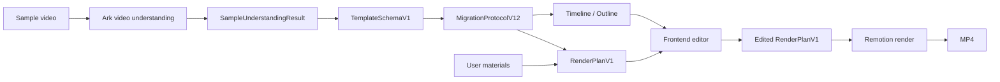

# Pipeline Architecture

The project separates video understanding, editor state, and final rendering.
Generation is Remotion-only.

## Data Flow



## Stages

| Stage | Data | Owner |
| --- | --- | --- |
| Upload | sample video and materials | frontend / backend uploads |
| Understanding | `SampleUnderstandingResult` and `TemplateSchemaV1` | `backend/src/modules/video-understanding/` |
| Adapter | `MigrationProtocolV12` | `shared/lib/template-to-migration.adapter.ts` |
| Derivation | timeline, outline, render plan | `shared/lib` |
| Editing | patched structure and render plan | frontend stores + backend PATCH APIs |
| Rendering | `RenderPlanV1` | Remotion generator worker |

## PipelineBundle

```ts
interface PipelineBundle {
  task_id: string
  task_status: string
  ingest: VideoIngest
  structure: MigrationProtocolV12
  timeline: TimelineProject
  materials: UserMaterialDto[]
  outline: OutlineSegment[]
  render_plan: RenderPlanV1
}
```

## APIs

| Method | Path | Purpose |
| --- | --- | --- |
| `POST` | `/api/uploads` | Upload sample or material files |
| `POST` | `/api/tasks/analyze` | Create understanding task |
| `GET` | `/api/tasks/:id/pipeline` | Load the full editing bundle |
| `PATCH` | `/api/tasks/:id/structure` | Save edited structure |
| `PATCH` | `/api/tasks/:id/render-plan` | Save edited render plan |
| `POST` | `/api/tasks/:id/copilot` | Enqueue Remotion render |

## Backend Ports

| Port | Implementation |
| --- | --- |
| `VideoAnalyzerPort` | Ark understanding service plus local development analyzer |
| `VideoGeneratorPort` | Remotion generator service |

## Frontend Responsibilities

- Hydrate the editor from `PipelineBundle`.
- Show user-facing sample understanding details.
- Let users edit renderable scene controls: visual material, motion, subtitles,
  effects, transitions, and audio.
- Persist both structure edits and render-plan edits before generation.
