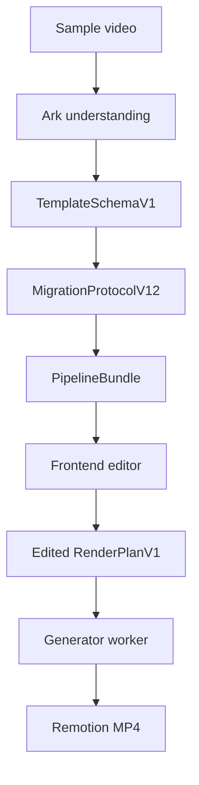

# Project Overview

This repository is a prototype AI video editor for sample-based short-video
replication. The current implementation keeps generation local and deterministic
through Remotion.

## What Works

- Upload a sample video and optional reference materials.
- Run Ark multimodal understanding.
- Convert understanding output into editable `MigrationProtocolV12`.
- Derive timeline, outline, material matches, and `RenderPlanV1`.
- Edit scene intent, visual material, motion, subtitles, effects, transitions,
  and audio in the frontend.
- Render MP4 through Remotion from the saved render plan.

## Main Flow

## Repository Map

| Path | Purpose |
| --- | --- |
| `backend/src/app.ts` | Express API entry |
| `backend/src/workers/analyzer.worker.ts` | Understanding queue worker |
| `backend/src/workers/generator.worker.ts` | Remotion generation queue worker |
| `backend/src/modules/video-understanding/` | Ark understanding integration |
| `backend/src/modules/generator/` | Generation job processor and Remotion generator |
| `backend/src/modules/render-engine/` | Remotion CLI bridge and props conversion |
| `fonted/src/` | React editor UI |
| `shared/types/` | Shared protocol types |
| `shared/lib/` | Adapters and derivation helpers |
| `remotion/src/` | Remotion composition |

## Current Limits

- The sample video is used for understanding, not as a default fill material.
- Render output depends on assets that Remotion can read through local paths or
  accessible URLs.
- Complex multi-layer video compositing is not the default render model.
- Understanding requires a valid Ark key unless a precomputed structure is used.

## Useful Docs

| Doc | Topic |
| --- | --- |
| `docs/ARCHITECTURE.md` | System architecture |
| `docs/PIPELINE.md` | Data flow and contracts |
| `docs/LOCAL_INTEGRATION.md` | Local startup |
| `docs/MODULES_INTEGRATION.md` | Module boundaries |
| `docs/SAMPLE_UNDERSTANDING_LAYER.md` | Understanding workflow |
