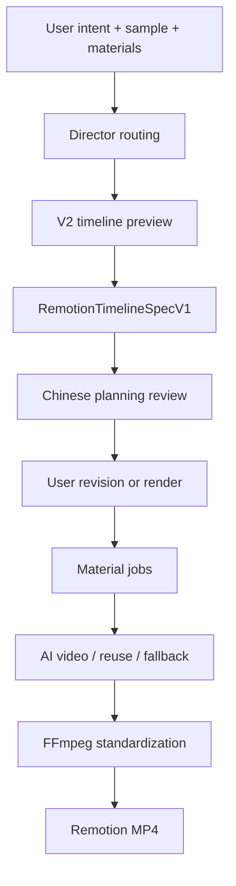

# Project Overview

This repository is a prototype AI video editor for timeline-first hybrid short
video generation. The active V2 path uses an agent to plan a strict
`RemotionTimelineSpecV1`, optional video models to create realistic missing
shots, FFmpeg to normalize media, and Remotion to render deterministic timeline
composition.

## What Works

- Upload a sample video as structure/style reference.
- Upload local image/video/audio materials and publish image inputs when an
  external video model needs a public URL.
- Generate a V2 timeline planning review before expensive rendering.
- Resolve planned material jobs through reuse, AI-video generation, or fallback
  scenes.
- Normalize provider/local media with FFmpeg and render MP4 through Remotion.

## Main Flow

## Repository Map

| Path | Purpose |
| --- | --- |
| `backend/src/app.ts` | Express API entry |
| `backend/src/pipeline-v2/` | V2 timeline planning, validation, material generation, standardization, rendering, trace |
| `backend/src/modules/upload/` | Local uploads and optional public asset publishing |
| `backend/src/modules/video-task/` | Historical task list/detail/cancel compatibility APIs |
| `fonted/src/` | React editor UI |
| `shared/types/` | Shared protocol types |
| `shared/lib/` | Adapters and derivation helpers |
| `remotion/src/` | Remotion composition |

## Current Limits

- The sample video is used as structure/style reference, not as a default fill material.
- Render output depends on assets that Remotion can read through local paths or
  accessible URLs.
- External video generation needs a public HTTPS image URL, not localhost.
- Remotion handles deterministic composition; realistic missing shots belong to
  the configured video model or fallback material.

## Useful Docs

| Doc | Topic |
| --- | --- |
| `docs/ARCHITECTURE.md` | System architecture |
| `docs/PIPELINE.md` | Data flow and contracts |
| `docs/LOCAL_INTEGRATION.md` | Local startup |
| `docs/MODULES_INTEGRATION.md` | Module boundaries |
| `docs/SAMPLE_UNDERSTANDING_LAYER.md` | Understanding workflow |
