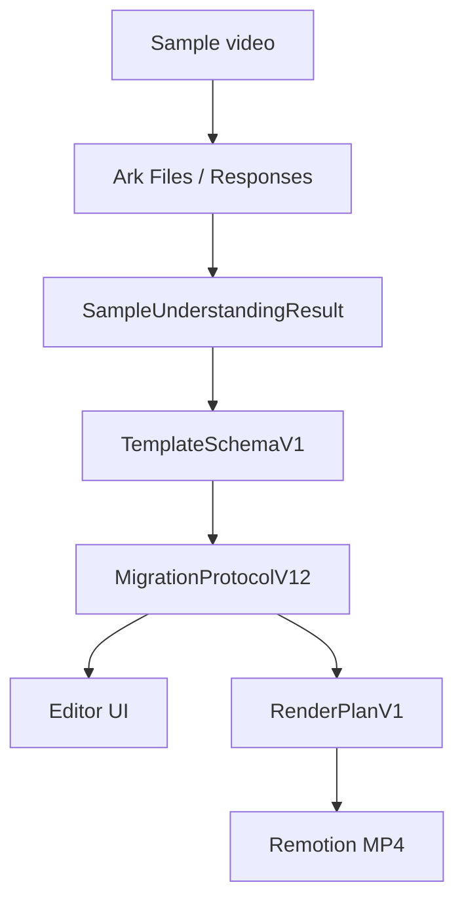

# Sample Understanding Layer

The sample understanding layer turns a reference video into reusable director
structure. Its job is not just to describe the video; it should produce editable
segments, material slots, style cues, timing evidence, and replication guidance
that can be converted into `MigrationProtocolV12` and `RenderPlanV1`.

## Current Position



The current implementation uses Ark as the end-to-end multimodal analyzer. The
planned skill pipeline can be introduced behind the same output contract.

## Target Skill Pipeline

```text
sample video
  -> preprocessor: frames, audio, metadata
  -> ASR skill
  -> OCR skill
  -> vision skill
  -> motion skill
  -> rhythm skill
  -> emotion skill
  -> feature aggregator
  -> planner LLM
  -> TemplateSchemaV1
```

## Skills

| Skill | Input | Output |
| --- | --- | --- |
| ASR | audio | speech segments with start/end/text |
| OCR | frames | visible captions and on-screen text |
| Vision | keyframes | scene, object, shot type, composition |
| Motion | frame sequence | camera motion and subject movement |
| Rhythm | audio and timing | beats, pacing, emphasis points |
| Emotion | visual/audio features | mood curve and intensity |

## Output Contract

`TemplateSchemaV1` should include:

| Field | Meaning |
| --- | --- |
| `structure[]` | director segments with timing, purpose, camera, motion, and subtitle intent |
| `slots[]` | replaceable material requirements |
| `style_features` | subtitle style, transition tendency, BGM, pace, and visual language |
| `viral_points[]` | attention peaks and why they work |
| `sample_understanding` | reusable narrative and conversion logic |

## Mapping To Editor

| Template field | Editor / render field |
| --- | --- |
| `structure[].id` | `semantic_anchors[].anchor_id` |
| `structure[].start/end` | `start_sec` / `end_sec` |
| `structure[].purpose` | `logic_intent.purpose` |
| `structure[].camera/motion` | visual prompt and motion defaults |
| `structure[].subtitle` | overlay instruction / render overlays |
| `slots[]` | material match and gap hints |
| `style_features` | effect, transition, and audio presets |

Adapter: `shared/lib/template-to-migration.adapter.ts`.

## Migration Plan

1. Keep the current Ark analyzer as the production path.
2. Add deterministic preprocessing artifacts for audit and debugging.
3. Introduce skills one by one behind the same aggregate feature bundle.
4. Let planner LLM emit strict `TemplateSchemaV1`.
5. Keep frontend and Remotion consuming `MigrationProtocolV12` and
   `RenderPlanV1`.
